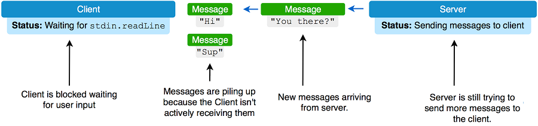
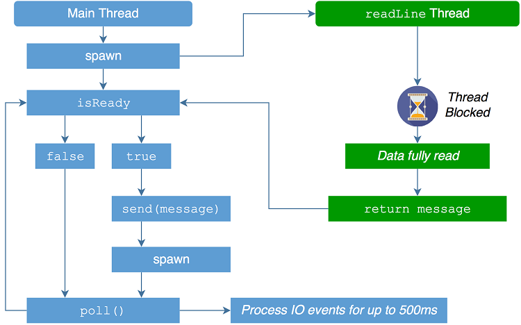

第三章 编写聊天应用程序
===================

本章涵盖：

* 要求用户输入
* 创建命令行界面
* 解析和生成 JSON
* 通过网络传输数据
* 使用和创建模块

在上一章中，您学习了如何设置 Nim 编译器及其环境，从而允许您编译您的第一个 Nim 应用程序。您还学习了 Nim 编程语言的基础知识，包括语法、一些内置类型、有关如何定义变量和过程的信息、控制流语句、异常处理、如何定义自定义类型等。

在本章中，您将通过开发功能齐全的聊天应用程序来构建和巩固这些知识。您还将学习许多对某些应用程序的开发至关重要的新概念。特别是，您将：

* 构建命令行界面，该界面将充当请求用户输入的一种方式。
* 了解如何使用套接字通过互联网等网络传输数据。
* 使用 JSON 解析器构建简单的聊天协议。这将用于允许您的聊天应用程序以标准和一致的方式交换消息。
* 了解如何使用模块将代码分离为独立的单元，这将使代码更易于重用。

随着互联网的普及，计算机网络变得越来越重要。互联网最基本的功能是数据传输，这一功能在编程语言级别可能不是很容易。聊天应用程序是介绍在多台计算机之间传输数据的基础知识的好方法，这就是为什么我将在本章中将其用作示例的原因。

在本章结束时，您将成功编写一个由两个不同组件组成的应用程序：服务器和客户端。您将能够将客户端组件发送给您的朋友，然后使用它通过互联网实时聊天。

让我们开始吧。下一节将向您介绍应用程序如何工作的详细信息。

3.1 聊天应用程序的体系结构
----------------------

聊天应用程序的主要目的是允许多人使用他们的个人计算机进行通信。完成此任务的一种方法是使用这些计算机连接到的网络（如 Internet）并通过该网络发送数据。与主要用于一对一通信的Facebook Messenger或WhatsApp等应用程序不同，本章开发的聊天应用程序将主要支持类似于Internet Relay Chat或Slack的群组通信（多对多）。这意味着一条消息将发送给多个用户。

完成的应用程序会是什么样子？

假设我刚刚看了最新的《权力的游戏》剧集，现在很高兴能和我的朋友谈论它。我会称他们为约翰和格蕾丝，以防他们不喜欢我在本书中使用他们的真实姓名。谈话可能会是这样的（我保证没有权力的游戏剧透）：

清单 3.1.我、约翰和格蕾丝关于《权力的游戏》的对话
```
*Dominik said* What did you guys think about the latest Game of Thrones
episode?
*Grace said* I thought Tyrion was really great in it!
*John said* I agree with Grace. Tyrion deserves an Emmy for his performance.
```

在本章结束时，您将构建一个应用程序，该应用程序将允许进行此讨论。让我向您展示完成的应用程序在清单 3.1 中概述的对话上下文中的样子。

执行聊天应用程序的客户端组件并允许它连接到服务器后，我将能够开始发送消息。我先问约翰和格蕾丝，他们对最新的《权力的游戏》剧集有什么看法。我将通过在聊天应用程序中输入我的消息，然后按 Enter 键发送它来执行此操作。

图 3.1.发送消息后的屏幕


约翰和格蕾丝都会在他们的计算机上收到这条消息。客户端应用程序将以相同的方式向两者显示它。

图 3.2.约翰和格蕾丝的屏幕


请注意，该消息以`多米尼克说`为前缀，让约翰和格蕾丝知道是谁发送了消息。然后，Grace 可以通过键入她的回复并按 Enter 键发送来回答我的问题。约翰和我都收到了她的回复。这样，我们可以相对轻松地在互联网上进行讨论。

这应该可以让您在本章结束时了解您的目标。当然，它可能不像包含图形用户界面的完整应用程序那样令人印象深刻，但这是一个开始。现在让我继续讨论此应用程序的一些基本方面，特别是其网络体系结构。

  **网络架构和模型**

此应用程序可以使用两种主要网络体系结构：对等网络和客户端-服务器模型。使用点对点网络时，没有服务器;相反，每个客户端都连接到多个其他客户端，然后在彼此之间交换信息。使用客户端-服务器模型，所有客户端都连接到单个服务器。消息全部发送到服务器，服务器将它们重新分发到正确的客户端。

图 3.3.客户端-服务器与点对点


客户端-服务器模型是两者中较简单的一个。由于它也适用于您将要编写的应用程序类型，因此它将用作此聊天应用程序的基础。

要考虑的另一件事是传输协议，您将使用该协议在应用程序中传输消息。目前使用的两个主要协议是TCP和UDP。这两种协议都广泛用于许多不同类型的应用，但它们在两个重要方面有所不同。

TCP 协议最重要的功能是它确保消息传递到其目的地。这是通过随消息一起发送额外信息来实现的，以验证消息是否已正确传递。TCP 协议以牺牲某些性能为代价来执行此操作。

UDP 协议不这样做。使用UDP，数据被快速发送，协议不会检查数据是否到达目的地。这使得UDP的性能优于TCP，但具有使数据传输可靠性降低的效果。

聊天应用程序应该是高效的，但消息的可靠传递更为重要。仅基于这一方面：TCP获胜。

>注意 网络
关于网络主题的信息量要多得多，这超出了本书的范围。如果您感兴趣，我鼓励您进一步研究这个主题。

**客户端和服务器组件**

现在您对网络方面有所了解，让我们谈谈软件的实际工作方式。计划是创建两个单独的应用程序，第一个是服务器，第二个是客户端应用程序。在本章中，我将客户端称为客户端组件，将服务器称为服务器组件。

当服务器首次启动时，它将开始侦听来自特定端口上的客户端应用程序的连接。端口将被硬编码到服务器中，并提前选择，以免与任何其他应用程序冲突。我不希望它阻止你现在享受《使命召唤》的精彩游戏，对吧？一旦检测到该端口上的连接，服务器将接受该连接并等待来自该端口的消息。新收到的消息将发送到服务器以前接受的任何其他连接。

当客户端首次启动时，它将连接到用户在命令行上指定的服务器地址。成功连接后，客户端的用户将能够通过命令行输入消息来向服务器发送消息。客户端还将主动侦听来自服务器的消息，一旦收到消息，它就会显示给用户。

图 3.4.聊天应用程序的操作


这些只是聊天应用程序如何运行的一些细节。图 3.8 显示了聊天应用程序在涉及 3 个客户端的简单用例中的操作。Dom、John 和 Grace 都是连接到服务器的正在运行的客户端。图 3.8 显示了 Dom 通过客户端向服务器发送`Hello`消息。服务器将接受此消息并将其传递给当前连接到它的其他客户端。

在本章结束时，我们的目标是完成一个应用程序，该应用程序将使我们能够实现图 3.8 中描述的场景。

您现在应该对聊天应用程序的工作方式有一个很好的了解，并且应该准备好开始实施它。下一节将向您展示如何操作！

3.2 启动项目
-----------

到现在为止，您应该对要构建的内容有所了解。上一节详细介绍了聊天应用程序的工作方式。本节将介绍开始项目所需的第一步。本章在很大程度上是一个练习，我鼓励你在阅读它时跟随发展。

你可能会感到惊讶，但在Nim启动一个项目是非常快速和容易的。只需打开您喜爱的文本编辑器，创建一个新文件并开始编码。但在此之前，您应该确定项目的目录布局。这是完全可选的，如果您将所有代码保存在`C:\code`中，编译器不会介意，但这样做是不好的做法。理想情况下，您应该仅为此项目创建一个新目录，例如`C:\code\ChatApp`（或`~/code/ChatApp`）。在该目录中创建一个`src`目录以存储所有源代码。将来，如果需要，您可以在项目中创建其他目录，如`tests`、`images`、`docs`等。大多数其他Nim项目也是这样布局的。这个项目很小，所以现在只使用`src`目录*下面的清单3.2*显示了典型的Nim项目目录布局。

清单 3.2.典型目录布局

MyAwesomeApp   ❶
├── bin        ❷
│   └── MyAwesomeApp
├── images     ❸
│   └── logo.png
├── src        ❹
│   └── MyAwesomeApp.nim
└── tests      ❺
    └── generictest.nim

>❶	`MyAwesomeApp`项目的根目录。
❷	此目录包含此项目的所有可执行文件。
❸	此目录包含此项目使用的所有图像。
❹	此目录包含与此项目相关的所有 Nim 源代码文件。
❺	此目录包含所有 Nim 源代码文件，其中包含对`src`中包含的文件的测试。
 

>注释 项目目录布局
良好的项目目录布局是非常有益的，特别是对于大型应用程序。最好尽早设置它。将应用程序源代码与测试分开意味着您可以轻松编写不冲突或不影响应用程序的测试代码。通常，分离也使代码导航更容易。

现在在`src`目录中创建一个文件`client.nim`。此文件将编译为可执行文件`client`，并充当聊天应用程序的客户端组件。

现在可以开始编写代码了。作为一个小测试，首先将以下内容写入新文件，然后保存`client.nim`。

```nim
echo("Chat application started")
```

为了编译您的新`client.nim`文件，请按照以下步骤操作。

1.打开新的终端窗口。
2.通过执行`cd ~/code/ChatApp`将`cd`插入项目目录，其中`~/codeChatApp`应替换为项目目录的路径。
3.通过执行`nim c src/client.nim`编译`client.nim`文件。

>提示 Aporia 
如果您使用的是Aporia，则只需按F4或在菜单栏中选择`工具>编译当前文件`即可编译当前选定的选项卡。也可以按 F5 进行编译和运行。

如果您正确完成了所有操作，您应该在终端窗口中看到以下内容。

图 3.5.成功编译`client.nim`.


>提示输出目录
默认情况下，Nim编译器将在与编译文件相同的目录中生成可执行文件。您可以使用`-o`标志来更改此设置。例如，`nim c -o:chat src/client.nim` 将在当前目录中放置一个`chat`可执行文件

假设编译成功，编译器创建的可执行文件现在可以启动了。要开始执行，请使用以下命令`/src/client`。这将在屏幕上显示`Chat application started`，然后退出。

您现在有了进一步发展的良好起点。我们起步很慢，到目前为止，您的应用程序并没有做太多事情。但它应该让您了解如何启动 Nim 中的所有应用程序，并确保 Nim 编译器在您的计算机上正常工作。

现在您已经开始了这个项目，让我们继续执行第一个任务：命令行界面。

3.3 检索客户端组件中的输入
----------------------

应用程序通常希望从用户那里获得某种指导，这可能是要导航到的网站的 URL 或要播放的视频的文件名。应用程序需要这种指导，因为它们（还）不能直接从我们的大脑中读取我们的意图，他们需要命令或鼠标点击形式的明确指令。指导软件的最简单方法是给它一个明确的命令。

在聊天应用程序的情况下，更具体地说是客户端组件。可以假设它所需的输入片段将包括要向其发送消息的服务器的地址以及要发送到该服务器的一条或多条消息。这些是聊天应用程序对用户的最低要求。

考虑到这些事情，需要有一种既可以要求用户输入特定输入的方法，又需要一种方法来实际获取用户使用键盘输入的数据。让我们关注用户所需的最低数据要求。我们要连接的服务器的地址有些关键。客户端在执行任何操作之前需要地址，因此我们应该在客户端启动后立即向用户询问该信息。在我们连接到服务器之前，用户将无法发送任何消息，因此要求用户发送消息之后。

**检索用户提供的命令行参数**

在命令行上，有两种方法可以从用户那里获取数据：

通过命令行参数，这些参数在应用程序启动时传递给应用程序。
通过标准输入流，可以随时读取。
通常，一条信息（如服务器地址）将通过命令行参数传递给应用程序，因为服务器地址需要在应用程序的最开始时知道。

在Nim中，可以通过`os`模块中定义的`paramStr`过程访问命令行参数。要使用`paramStr`过程，必须首先导入`os`模块。为此，在`client.nim`文件的顶部添加`import os`。然后，您可以扩展`client.nim`以读取第一个命令行参数，以便将代码更改为*清单3.3*中列出的代码。添加的代码以粗体显示。

清单 3.3.读取命令行参数

```nim
**import os**               ❶
echo("Chat application started")
**if paramCount() == 0:**   ❷
  **quit("Please specify the server address, e.g. ./client localhost")**   ❸

**let serverAddr = paramStr(1)**         ❹
**echo("Connecting to ", serverAddr)**   ❺
```

>❶	这是使用`os`模块中定义的`paramCount`过程所必需的。
❷	确保用户已在命令行上指定了参数。
❸	过早停止应用程序，因为如果没有该参数，它将无法继续。
❹	检索用户指定的第一个参数并将其分配给新`serverAddr`变量。
❺	向用户显示消息`"Connecting to <serverAddr>"`，其中 `<serverAddr>` 是用户指定的地址。

检查提供给可执行文件的参数数量总是很重要的。`paramCount`过程以整数形式返回参数数。上面的示例检查参数的数量是否为0，如果是，则调用`退出`过程，并显示应用程序退出的详细消息。`退出`过程退出应用程序，如果提供了一条消息，它将首先显示该消息并退出，退出代码告诉操作系统应用程序失败。

如果用户确实提供了命令行参数，则使用`paramStr`过程检索提供的第一个参数。使用索引1，因为可执行文件名存储在索引0处。然后将第一个命令行参数绑定到`serverAddr`变量。

>[警告]	可执行文件名称
不要通过 `paramStr(0)`检索可执行文件名称，因为它可能会提供不可移植的操作系统特定数据。应改用 `os` 模块中定义的`getAppFilename`过程。	

>[注意]	始终使用`paramCount`
|当通过不存在的 `paramStr`过程访问参数时（例如，当`paramCount() == 1`时为`paramStr(56)`），会引发`IndexError`异常。您应该始终提前使用 `paramCount`来检查已提供的参数数量。

*清单3.3*中的最后一行使用`echo`过程，在屏幕上显示附加到`serverAddr`变量内容的字符串`Connecting to`。`echo`过程接受可变数量的参数，并在同一行中显示每个参数。

>[提示] 分析命令行参数 
应用程序通常为命令行参数实现特殊语法。此语法包括`--help`等标志。尼姆标准库中包含的`parseopt`模块允许解析这些参数。Nim社区还为检索和解析命令行参数创建了其他更直观的包，您将在本书后面的章节中了解这些包。

使用上一节中的命令重新编译新的`client.nim`模块，并像以前一样执行它。

图 3.6.在没有任何参数的情况下启动客户端


如您在*图3.10*中所见，应用程序将立即退出，并显示消息*`Please specify the server address，e.g./client localhost`*。现在使用一个参数执行它，如示例中所示：`src/client localhost`。

图 3.7.使用1个参数启动客户端


您将注意到，应用程序现在显示消息 *"Connecting to localhost"*，现在尝试指定不同的参数并查看结果。

无论键入多少参数，只要至少有一个，消息将始终包含 *"Connecting to "* ，后跟指定的第一个参数。

*图3.12*显示了命令行参数如何映射到不同的`paramStr`索引。

图3.8提供的命令行参数及其访问方法


现在客户端成功捕获了服务器地址，它将知道要连接到哪个服务器。现在，您需要考虑向用户请求他们想要发送的消息。

**从标准输入流读取数据**

与在应用程序启动之前传递给它的命令行参数不同，我们希望用户能够实时发送消息，以响应他们从其他用户接收到的消息。这意味着我们希望我们的应用程序理想地做的是始终准备好从用户读取数据。

当应用程序在终端或命令行内部运行时，可以在终端窗口中键入字符。应用程序可以通过标准输入流检索这些字符。与Python一样，可以通过`stdin`变量访问标准输入流。在Nim中，此变量在隐式导入的`system`模块中定义，其类型为`File`。这意味着可以像读取任何其他"文件"对象一样读取标准输入流。为从 "File" 对象读取数据定义了许多过程，通常最有用的是从指定的"File"读取单行数据的`readLine`过程。

将*清单3.4*中的以下代码添加到`client.nim`的底部，然后重新编译并运行它（可以使用以下命令`nim c-r src/client.nim localhost`快速完成）。

清单 3.4.从标准输入流读取

```nim
let message = stdin.readLine()      ❶
echo("Sending \"", message, "\"")   ❷
```

>❶	从标准输入流中读取一行文本并将其分配给变量message。
❷	显示消息 *`"Sending "<message>""`*，其中`<message>`是变量`message`的内容，其中包含用户在其终端窗口中键入的文本行。
 

>注释字符转义序列
*清单3.4*中的最后一行使用字符转义序列来显示 `"` 字符。这需要转义，否则编译器会认为字符串文本已经结束

您将看到应用程序不再立即退出，而是等待您在终端窗口中键入内容并按Enter键。完成此操作后，将显示一条消息，其中包含您在终端窗口中键入的文本。

从标准输入流读取将导致应用程序停止执行，应用程序将被 *阻塞* 。一旦请求的数据被完全读取，将继续执行。在`stdin.readLine`的情况下，在用户向终端输入一些字符并按下`Enter`键之前，应用程序一直被阻塞。当用户执行这些操作时，实际上是将一行文本存储到`stdin`缓冲区中。

阻塞是大多数输入/输出调用的一个不幸的副作用，不幸的是，这意味着您的应用程序在等待用户输入时将无法执行任何有用的工作。这实际上是一个问题，因为该应用程序需要主动保持与聊天服务器的连接，如果它等待用户在终端窗口中键入文本，则无法做到这一点 *下图3.13* 显示了这导致的问题。

图3.9.客户端被无限期阻塞导致的问题



在我们继续解决这个问题之前。清单 3.4 中缺少一些东西，代码只读取消息一次，但目的是允许用户发送多条消息。这样做相对简单，你只需要使用 `while` 语句引入一个无限循环。只需将清单 3.4 中的代码包装在 `while` 语句中，如下所示。

```nim
while true:   ❶
  let message = stdin.readLine()   ❷
  echo("Sending \"", message, "\"")
```
>❶	该语句将在其正文中重复这些语句，而其条件为 。在这种情况下，它将重复其下面的两个语句，直到用户手动关闭应用程序。whiletrue
❷	这两行将无限重复，因为它们在 while 语句下缩进。

现在再次编译并运行代码，亲自查看结果是什么。您应该能够在终端窗口中输入任意数量的文本行，直到您当然通过按无处不在的 Control 和 C 组合键（同时按 Ctrl + C）终止应用程序。

终止应用程序时，应会看到类似于以下内容的回溯。

```bash
Traceback (most recent call last)
client.nim(9)            client
sysio.nim(115)           readLine
sysio.nim(72)            raiseEIO
system.nim(2531)         sysFatal
SIGINT: Interrupted by Ctrl-C.
```

终止应用程序实际上是确定当前正在执行哪一行代码的好方法。上面你可以看到，当应用程序终止时，`client.nim` 中的第 9 行正在执行，这对应于等待用户输入的阻塞调用。

```nim
let message = stdin.readLine()readLine
```

图 3.10.当前执行client.nim


图 3.14 显示了`client.nim`中的当前执行流程。主线程在等待用户输入时被阻塞。因此，应用程序将处于空闲状态，直到用户通过在终端窗口中键入一些文本并按 Enter 将其唤醒。这是阻塞输入/输出操作的固有问题，如果客户端只需要对用户的输入做出反应，我们无需担心。遗憾的是，如上所述，客户端必须保持与服务器的持久连接才能从其他客户端接收消息。

**使用`spawn`生成避免阻塞 输入/输出**

有多种方法可以确保您的应用程序在从标准输入流读取数据时不会阻塞。一种是异步输入/输出，即使结果不是立即可用，它也允许应用程序继续执行。不幸的是，标准输入流无法异步读取，因此这次不能使用异步 I/O，但稍后将通过网络传输数据时使用。届时将更详细地解释。另一种解决方案是创建另一个线程，该线程将读取标准输入流，保持主线程畅通无阻并自由执行其他任务。我现在将向您展示如何修改`client.nim`以实现此解决方案。

并行性的全部细节及其在 Nim 中的工作原理将在本章中不描述，但将在本书后面介绍。简而言之，每个进程至少包含一个线程，默认情况下，一个进程仅从一个称为主线程的线程开始。`client.nim`中指定的所有代码当前都在该主线程中执行。调用 `readLine` 时，此主线程将被阻塞。当用户在终端中输入一行时，线程将变得畅通无阻。可以创建一个单独的线程以使主线程保持活动状态，从而确保创建的线程是被阻塞的线程。

可以使用`spawn`过程在新线程中执行过程。以下代码演示如何执行此操作。将其替换为之前创建的 while 语句，但暂时不要编译代码。

```nim
while true:
  let message = spawn stdin.readLine()   ❶
  echo("Sending \"", ^message, "\"")     ❷
```

>❶	现在使用`spawn`关键字来调用`readLine`过程，这将产生一个新线程并在那里执行`readLine`。
❷	从线程返回的值不会立即可用，因此读取它必须由操作符`^`显式完成。

`readLine`过程返回字符串值。但是当这个过程在另一个线程中执行时，它的返回值不是立即可用的。为了解决这个问题，`spawn` 返回一个名为`FlowVar[T]`的特殊类型。此类型保存您派生的过程返回的值。

`^`运算符可用于检索`FlowVar[T]`类型保存的值。但`FlowVar[T]`对象可能不总是包含值，它将开始为空，一旦派生过程返回值，`FlowVar[T]`对象将包含该值。当`FlowVar[N]`对象为空时，`^`运算符将阻止当前线程，直到`FlowVar[T]`不再为空。如果一开始不为空，则`^`运算符将立即返回值。

这就是为什么上面的代码实际上会以与前面代码类似的方式运行。幸运的是，您还可以使用`isReady`过程检查`FlowVar[T]`类型是否包含值。使用该过程将允许应用程序避免阻塞行为。

**泛 型**

泛型是Nim的一个特性，您将在*第9章*中详细介绍。目前，您只需要知道`FlowVar[T]`是一种泛型类型。这允许它存储任何类型的值，存储的值的类型在方括号中指定。

例如，`spawn stdin.readLine()` 表达式返回`FlowVar[string]`类型，因为`readLine`的返回类型是`string`，并且因为`FlowVar`包装派生过程的返回值。

将`spawn`派生调用应用于任何返回字符串`string`的过程将产生`FlowVar[string]`值：

```nim
import threadpool
proc foo: string = "Dog"
var x: FlowVar[string] = spawn foo()
assert(^x == "Dog")
```

参见*图3.15*，了解两个不同的线程如何相互作用。将其与*图3.14*进行比较，看看在引入`spawn`之后，`client` 的执行是如何变化的。

图3.11 `client.nim`的当前执行


现在有一个辅助`readLine`线程，但结果是相同的，主线程和`readLine`线程都被阻塞，产生相同的结果。

现在让我向您展示如何修改`client.nim`以使用`spawn` *清单3.5* 以粗体显示了更改行的完整代码。需要注意的关键点是，`spawn` 过程是在`threadpool`模块中定义的，因此您必须记住通过`import threadpool`导入它。

清单3.5.到目前为止`client.nim`中的代码

```nim
import os, **threadpool**

echo("Chat application started")
if paramCount() == 0:
  quit("Please specify the server address, e.g. ./client localhost")
let serverAddr = paramStr(1)
echo("Connecting to ", serverAddr)
while true:
  let message = **spawn** stdin.readLine()
  echo("Sending \"", **^message**, "\"")
```

编译现在需要`--threads:on`标志。要编译并运行`client.nim`文件，现在应该在`src/client.nim localhost`上执行`nim c -r --threads:on`。`--threads:on`标志是打开Nim的线程支持所必需的，如果没有它，`spawn`就无法运行。

>提示 Nim配置文件
诸如`--threads:on`标志之类的标志可能越来越多。Nim编译器支持配置文件，您无需在命令行上重新键入所有这些标志。只需创建一个`client.nim.cfg`文件（在`client.nim`文件旁边），然后在其中添加`--threads:on`。每个标志都需要在自己的行上，这样您就可以通过用换行符分隔它们来添加额外的标志。

`client`应用程序的行为仍与以前相同。但是，对标准输入流读取代码所做的更改将在本章稍后部分有用。在下一节中，我将向您展示如何添加允许客户端应用程序连接到服务器的异步网络代码。服务器本身也将使用相同的异步I/O方法，以便一次与多个客户端通信。

本节向您展示了如何在应用程序运行期间以两种不同的方式从用户读取输入，即作为命令行参数和从标准输入流读取输入。我还讨论了标准阻塞I/O的问题，并向您展示了解决它的一种方法。现在，让我们继续编写聊天应用程序的协议。

3.4 实现协议
-----------

通过网络与另一个应用程序通信的每个应用程序都需要定义用于该通信的协议。协议可确保两个应用程序可以相互理解。它类似于我们人类使用的自然语言，也是一种基本一致的标准，并且可以被通信双方理解。想象一下，试图与一个只会说中文的人用英语交流。你不会理解他们，他们也不会理解你。同样，应用程序中的不同组件必须使用相同的语言进行通信才能相互理解。


重要的是要记住，即使协议定义良好，仍然有很大的错误空间。消息可能只是未正确传输。这就是为什么解析给定消息的代码可以处理格式不正确的消息或不包含所需数据的消息至关重要的原因。我将在本节中向您展示的代码不会竭尽全力验证它收到的消息的有效性。但我鼓励您稍后花时间添加异常处理代码，以验证消息的有效性，并为代码用户提供更好的异常消息。

解析和生成消息的代码易于测试。因此，我还将在本节中向您展示一些测试代码的基本方法。

聊天应用程序的协议将是一个简单的协议。它将在客户端之间传输的信息仅包含用户决定发送给其他客户端的消息和用户名。

有很多方法可以对这些信息进行编码，但最简单的方法之一是将其编码为 JSON 对象，这就是我将向您展示如何操作的内容。

3.4.1 模块
----------

您已经看到许多模块示例。您编写的`client.nim`文件本身就是一个模块，并且您还使用`import`关键字将 Nim 标准库中的模块导入到您的代码中。

到目前为止，我还没有确切地解释模块是什么。如今，许多编程语言都使用模块系统。Nim的模块系统相当简单：每个Nim文件，即以`.nim`扩展名结尾的文件，也是一个模块。只要编译器可以找到该文件，就可以成功导入该文件。

我在本书的这一点上向你解释模块系统的原因是因为，理想情况下，即将推出的消息解析器应该写在一个单独的模块中，我认为最好用一个实际的例子来解释它。模块系统允许您将应用程序的功能分离到独立的模块中。在我们的例子中，这样做的一个优点是模块是可互换的。只要模块的接口保持不变，就可以更改它实现的底层协议。因此，稍后您可以轻松地使用 JSON 以外的其他内容对消息进行编码。

现在创建一个模块来容纳您的新消息解析器，只需在`client`文件旁边的`src`目录中创建一个名为`protocol.nim`的新文件。这样做之后，您的`src`源目录将同时包含`client` 和 `protocol`模块。

默认情况下，您在模块中定义的所有内容只能在该模块内部访问，不能在模块外部访问，因为它是私有的。这允许您隐藏模块的某些实现细节，并精确地决定哪些应该向导入它的模块公开。在某些语言中，`public`和`private`关键字用于指定定义的可见性，[12]在 Nim 中，默认情况下每个定义都是私有的，因此只需要将其公开，这可以使用`*`运算符来完成。

可以放`*`在过程名称、变量名称、方法名称和字段名称的末尾。

清单 3.6.消息类型定义和过程定义

```nim
type
  Message* = object     ❶
    username*: string   ❷
    message*: string

proc parseMessage*(data: string): Message =   ❸
  discard   ❹
```

>❶	此行定义一个新类型`Message`。导出标记`*`放置在类型名称之后。
❷	两个字段定义遵循类型定义，并以类似的方式导出。
❸	此行定义一个新过程`parseMessage`。导出标记也用于名称后以导出它。
❹	这`discard`是必需的，因为过程的主体不能为空。

*清单3.6*显示了`Message`类型的定义，它将存储来自服务器的消息包含的两条信息，即客户端的用户名和实际消息。这些定义中的每一个都使用`*`标记导出。最后定义了`parseMessage`过程。它接收字符串类型的`data`，这是客户端从服务器接收的原始字符串，或者由客户端发送的原始字符串（取决于您如何看待它）。然后，`parseMessage`过程返回一个类型为`Message`的值，这是已解析的消息。该过程也被导出，它与`消息`类型一起构成`协议`模块的公共接口。

现在应该将*清单3.6*中的代码添加到前面创建的`protocol`模块中。然后确保它使用`nim c src/protocol`进行编译。

模块系统的基础知识应该很容易掌握，因为它们很简单。还有一些额外的事情需要注意，但这足以让您开始编写简单的模块。现在让我们继续实现`parseMessage`过程。


3.4.2 解析 JSON
--------------

JSON 是一种非常简单的数据格式。它被广泛使用，Nim在其标准库中支持解析和生成JSON。这使得 JSON 成为存储两个消息字段的完美候选者。

一个典型的JSON片段由一个包含多个字段的对象组成，字段名称是简单带引号的字符串，值可以是整数，浮点数，字符串，数组或其他对象中的任何一个。

让我们回顾一下我在本章开头定义的关于《权力的游戏》的对话。我将发送的第一条消息将是`你们对最新的《权力的游戏》剧集有什么看法？这可以像这样使用 JSON 表示。

清单 3.7.JSON 中消息的表示形式
```nim
{   ❶
  "username": "Dominik",   ❷
  "message": "What did you guys think about the latest Game of Thrones episode?"   ❸
}
```

>❶	大括号定义对象。
❷	具有相应值的`username`字段。
❸	具有相应值的`message`字段。

在Nim中解析JSON非常容易。首先，通过在文件顶部添加`import json`来导入`json`模块。然后将`parseMessage`过程中的`discard`语句替换为`let dataJson = parseJson(data)` *清单3.8*以粗体显示了添加内容的代码。

清单3.8.解析`protocol.nim`中的JSON

```nim
**import json**
type
  Message* = object
    username*: string
    message*: string

proc parseMessage*(data: string): Message =
  **let dataJson = parseJson(data)**
```

在`json`模块中定义的`parseJson`过程接受字符串并返回`JsonNode`类型的值。

`JsonNode`类型是一种变体类型。这意味着可以访问的字段由总是在该类型中定义的一个或多个其他字段的值确定。在`JsonNode`的情况下，`kind`字段决定了解析的JSON节点的类型。

**关于变体类型的一些信息**

变量类型是一种对象类型，其字段根据一个或多个字段的值而变化。让我直接举个例子，因为这样解释它们要容易得多。

清单3.9.使用变量类型对盒子建模

```nim
type
  Box = object           ❶
    case empty: bool     ❷
    of false:            ❸
      contents: string   ❹
    else:
      discard            ❺

var obj = Box(empty: false, contents: "Hello")   ❻
assert obj.contents == "Hello"                   ❼

var obj2 = Box(empty: true)
echo(obj2.contents)      ❽
```

>❶ 变量类型的定义方式与普通对象类型类似。
❷ 区别在于对象定义下的`case`语句。这实际上定义了此类型中的 `empty`字段
❸ 如果 `empty` 字段为`false`，则可以访问此分支下定义的字段
❹ 如果  `empty == false`，则可以访问`contents`字段
❺ 如果 `empty == true`，则不定义其他字段
❻ 当构造函数中的 `empty`字段设置为`false`时，也可以指定`contents`字段
❼ 由于 `obj.empty` 为`false`，因此可以访问`contents`字段
❽ 这将导致错误，因为无法访问`contents`字段。无法访问它，因为 `empty`是`true`

*清单3.9*显示了如何对可能为空的普通盒子进行建模。在*清单3.9*的末尾，我展示了一个错误的情况，其中访问了一个空盒子的内容。编译和运行上述代码会导致错误也就不足为奇了。

```bash
Traceback (most recent call last)
variant.nim(13)          variant
system.nim(2533)         sysFatal
Error: unhandled exception: contents is not accessible [FieldError]
```

这只是一个非常简单的变体类型，只有两个状态。也可以在变量类型的`case`语句中使用枚举类型。这非常常见，用于`JsonNode`类型。

有7种不同的`JsonNodeKind`。`JsonNodeKind`类型是一个枚举，每种JSON值都有一个值*清单3.10*提供了所有7个以及它们映射到的`JsonNodeKind`的列表。

清单3.10.JSON值与`JsonNodeKind`类型之间的映射

```nim
assert parseJson("null").kind == JNull
assert parseJson("true").kind == JBool
assert parseJson("42").kind == JInt
assert parseJson("3.14").kind == JFloat
assert parseJson("\"Hi\"").kind == JString
assert parseJson("""{ "key": "value" }""").kind == JObject
assert parseJson("[1, 2, 3, 4]").kind == JArray
```

当解析任意JSON数据时，需要一个变量类型，因为编译器无法在编译时知道生成的JSON类型应该是什么。这只有在运行时才知道。这就是`parseJson`过程返回`JsonNode`类型的原因，该类型的内容因传递到`parseJson`过程的JSON值的类型而异。

*清单3.10*中显示的最后两个JSON值是集合。`JObject`类型表示`string`和`JsonNode`之间的映射。`JArray`类存储`JsonNode`的列表。

可以使用``[]``运算符访问`JObject`的字段。它类似于数组和序列`[]`运算符，但采用`string`作为其参数。该字符串确定要从`JObject`中检索值的字段。需要记住的一点是，`[]`运算符返回一个`JsonNode`值。

```nim
import json
let data = """
  {"username": "Dominik"}
"""

let obj = parseJson(data)    ❶
assert obj.kind == JObject   ❷
assert obj["username"].kind == JString    ❸
assert obj["username"].str == "Dominik"   ❹
```

>❶	只需解析字符串`data`并返回一个`JsonNode`类型，然后将其分配给`obj`变量。
❷	返回的`JsonNode`具有一种`JObject`类型，因为这是包含在`data`中的JSON类型。
❸	使用`[]`运算符访问字段。它返回另一个`JsonNode`，`kind`在这种情况下它是一个`JString`。
❹	因为`[]`运算符返回`JsonNode`，所以必须通过包含它的字段显式访问它所包含的值。在`JString`的情况下，这是`str`。不过，一般来说，最好使用`getStr`过程。
 

>[注意] `kind`很重要
在`JsonNode`的`kind`字段不是`JObject`的字符串上调用`[]`运算符将导致引发异常。

那么，如何从解析的``JsonNode``中检索``username``字段？使用`dataJson["username"]`将返回另一个`JsonNode`。除非已解析的``JObject``中不存在`username`字段，否则将引发``KeyError``异常。在上面的列表中，`dataJson["username"]`将返回的`JsonNode`类型将是`JString`，因为该字段包含一个`string`值。您可以使用``getStr``过程检索``string``值。每个``JsonNode``类型都有一个``get``过程，如果要返回的值的类型与``JsonNode``类型不匹配，则每个``get``程序将返回一个默认值。

>提示 `get`默认值|
可以重写`get`过程返回的默认值。要重写，请传递默认情况下要作为过程的第二个参数返回的值，例如`node.getStr("Bad kind")`。


现在，您只需要将此用户名分配给`Message`类型的新实例。请参见代码*清单3.11*，它显示了完整的`protocol`模块，添加的新分配以粗体显示。

清单3.11将解析的数据分配给结果变量

```nim
import json
type
  Message* = object
    username*: string
    message*: string

proc parseMessage*(data: string): Message =
  let dataJson = parseJson(data)
  **result.username = dataJson["username"].getStr()**   ❶
  **result.message = dataJson["message"].getStr()**     ❷
```

>❶	获取`"username"`键下的值，并将其字符串值分配给结果`Message`的`username`字段。
❷	在此处执行相同的操作，但改为获取`"message"`键下的值。

只需简单地添加两行代码即可完成。

**神奇的变量`result`**

您可能想知道 3.11 中的`result`变量来自哪里。答案是，Nim隐式地为你定义了它。此·变量在使用返回类型定义的所有过程中定义。

```nim
proc count10(): int =
  for i in 0 .. 10:
    result.inc
assert count10() == 10
```

这意味着您不需要重复定义`result`变量，也不需要返回它。`result`变量将自动为您返回。回顾第2章中的`过程定义`一节，了解更多信息。

您应该尽可能快速和频繁地测试代码。现在可以通过开始将新模块与客户端模块集成来实现这一点，但最好将代码作为单独的单元进行测试。协议模块是隔离测试的良好代码单元。测试模块时，最好测试每个导出的过程，以确保它们按预期工作。协议模块当前只导出一个过程，即`parseMessage`过程，因此您只需要为其编写测试。

在Nim中测试代码有多种方法，最简单的方法是使用`doAssert`过程。`doAssert`过程在`system`模块中定义。它类似于`assert`过程，它接受一个`boolean`类型的参数，如果该`boolean`的值为`false`，则引发`AssertionFailed`异常。它与`assert`有一个简单的区别，即在发布模式下编译应用程序时（通过`-d:release`标志），`assert`语句会被优化去掉，而`doAssert`语句则不会。

>注意：发布模式
默认情况下，Nim 编译器在Debug调试模式下编译应用程序。在调试模式下，您的应用程序运行速度稍慢，但会执行某些检查，这些检查会为您提供有关可能意外引入程序的某些错误的更多信息。部署应用程序时，为了获得最佳性能，应使用`-d:release`将其置于发布模式的标志对其进行编译。

让我们定义一个输入，然后用`doAssert`测试`parseMessage`的输出。

清单 3.12.测试新功能
```nim
when isMainModule:   ❶
  block:             ❷
    let data = """{"username": "John", "message": "Hi!"}"""   ❸
    let parsed = parseMessage(data)      ❹
    doAssert parsed.username == "John"   ❺
    doAssert parsed.message == "Hi!"     ❻
```

>❶ `when`语句是一个编译时的`if`语句，它仅在其条件为`true`时包含其下的代码。当尚未导入当前模块时，`isMainModule`常量为`true`。这意味着如果导入此模块，测试代码将被隐藏。
❷	开始一个新的作用域，用于隔离测试。
❸	这里我使用三引号字符串文字语法来定义要解析的数据，三引号字符串文字意味着 JSON 中的单引号不需要转义。
❹	对上面定义的数据调用`parseMessage`过程。
❺	检查`parseMessage`解析的用户名是否正确。
❻	检查`parseMessage`解析的消息是否正确。

将清单 3.12 中的代码添加到文件底部，然后编译并运行代码。程序应成功执行，没有输出。虽然这一切都很好，但至少收到某种消息让您知道测试成功会很好，因此只需添加`echo("All tests passed!")`到文件底部即可。只要所有测试都通过，您的程序现在应该输出该测试。

尝试更改其中一个断言以检查不同的输出并观察发生的情况。例如，从语句`doAssert parsed.message == "Hi!"`中删除感叹号将导致以下错误。

```nim
Traceback (most recent call last)
protocol.nim(17) protocol
system.nim(3335) raiseAssert
system.nim(2531) sysFatal
Error: unhandled exception: parsed.message == "Hi"  [AssertionError]
```

如果你修改协议模块并破坏你的测试，你可能会发现突然你会得到这样的错误。

您现在有一个正确输入的测试，不正确的输入呢？创建另一个测试以查看输入不正确时会发生什么情况。

```nim
block:
  let data = """foobar"""
  let parsed = parseMessage(data)
```
现在编译并运行`protocol.nim`，你应该得到以下输出。

```nim
Traceback (most recent call last)
protocol.nim(21) protocol_progress
protocol.nim(8)  parseMessage
json.nim(1086)   parseJson
json.nim(1082)   parseJson
json.nim(1072)   parseJson
json.nim(561)    raiseParseErr
Error: unhandled exception: input(1, 5) Error: { expected [JsonParsingError]
```

由于指定的数据不是有效的 JSON，因此引发了异常。但这是应该发生的事情，因此在测试中通过捕获异常并确保`parseJson`已引发异常来定义它。

```nim
block:
  let data = """foobar"""
  try:
    let parsed = parseMessage(data)
    doAssert false   ❶
  except JsonParsingError:   ❷
    doAssert true
  except:
    doAssert false
```

>❶	此行永远不应执行，因为`parseMessage`会引发异常。
❷	确保引发的异常是预期的异常。

`parseMessage`过程报告错误的理想方法是引发自定义异常。但这超出了本章的范围。我鼓励您在学习了如何实现它之后再回来实现它。现在让我们继续生成JSON。

3.4.3 生成 JSON
-----------------

您已经成功解析了JSON，现在让我们继续生成JSON。协议模块需要能够解析和生成消息。值得庆幸的是，生成JSON甚至比解析它更简单。

在Nim中，JSON可以通过多种方式生成。一种方法是简单地创建一个字符串，其中包含与值连接的正确JSON，就像在第一次测试中所做的那样。这会起作用，但容易出错，因为很容易漏掉JSON的某些语法元素。另一种方法是构造新的`JsonNode`，并使用 `$` 运算符将其转换为字符串。让我们现在就这么做。首先定义新的`createMessage`过程，然后使用 ` % ` 运算符创建新的`JsonNode`对象 *清单3.13* 显示了如何定义`createMessage`过程。


清单 3.13.创建新消息

```nim
proc createMessage*(username, message: string): string =
  result = $(%{   ❶
    "username": %username,   ❷
    "message": %message
  }) & "\c\l"   ❸
```

>❶	`$` 将`%`运算符返回的`JsonNode`转换为字符串
❷ `%`将字符串、整数、浮点等转换为适当的`JsonNode`。
❸	回车符和换行符将添加到消息末尾。它们充当消息的分隔符。
 

>注意 表构造函数语法
您在上面的代码清单中看到的`{:}`语法称为表构造函数。它只是数组构造函数的语法糖，即 `{"key1": "value1", "key2": "value2"}`与`[("key1", "value1"), ("key2, "value2")]`相同。

`%`运算符非常强大，因为它可以将各种不同类型的值转换为适当的`JsonNode`类型。这允许使用非常直观的语法创建JSON。

按照惯例，`$`是用于将任何类型转换为`string`值的运算符。在`JsonNode`的情况下，为其定义的`$`运算符将生成生成的`JsonNode`对象的有效JSON字符串文字表示。

当客户端和服务器组件需要接收消息时，添加回车符和换行符（某些操作系统使用换行符表示换行符）将很有用。他们需要一种方法来确定一条新消息何时停止，另一条消息何时开始，本质上这些字符将是消息分隔符。在实践中，可以使用任何分隔符，但`\c\l`序列已在许多其他协议中普遍使用，并且由Nim的网络模块支持。

与`parseMessage`过程一样，您也应该为`createMessage`过程添加测试。只需再次使用`doAssert`，以确保输出符合预期。记住在预期输出中包含`\c\l`。下面的代码列表显示了一个可以执行的测试，将其添加到`protocol.nim`的底部。

```nim
block:
  let expected = """{"username":"dom","message":"hello"}""" & "\c\l"   ❶
  doAssert createMessage("dom", "hello") == expected
```

>❶	这里要注意的一件有趣的事情是，三引号字符串文字根本不支持任何字符转义序列。作为一种解决方法，我只是将它们连接起来。

重新编译模块并运行它以确保测试通过。（可选）您可以通过检查不同的输入来进一步扩展测试，例如包含 JSON 中具有特殊含义的字符（如字符）的输入。"

假设所有测试都通过了，那么您已经成功完成了模块`protocol`，现在已准备好进入此应用程序开发的最后阶段！

[12]特别是C++和Java使用 `public` 和 `private` 关键字来表示标识符的可见性。

3.5 使用套接字`socket`传输数据
---------------------------

此时，您正在完成此聊天应用程序。`协议`模块已完成，`客户端`模块大部分已完成。在完成`客户端`模块之前，让我们看看迄今为止完全被忽略的`服务器`模块。

`服务器`模块可以说是最重要的模块之一，它将被单独编译以生成`server`二进制文件。如前所述，`server`将充当所有客户端都将连接到的中心集线器。`服务器`需要执行两项主要任务：
* 倾听潜在客户的新联系；
* 侦听来自已连接到服务器的每个客户端的新消息

`服务器`接收到的任何消息都需要发送到当前连接到它的每个其他`客户端`。

图3.12.聊天应用程序的操作


您在第一部分中看到的图 3.16 显示了服务器和客户端的操作。这是一个简化的图表，不包含任何协议细节。现在您已经熟悉了聊天应用程序将使用的协议，我可以向您展示将在图 3.16 中发送的确切消息。首先假设服务器已成功接受来自 Dom、John 和 Grace 的连接。以下事件按显示顺序发生。

清单 3.14.首先，客户端 Dom 向服务器发送消息

```json
{"username": "Dom", "message": "Hello"}   ❶
```

>❶	请记住，此消息后跟 `\c\l`

清单 3.15.然后服务器将相同的消息发送给客户端 John 和 Grace

```json
{"username": "Dom", "message": "Hello"}   ❶
```

>❶	此消息后还跟着 `\c\l`

您可以看到服务器只是将它收到的任何消息传递给其他客户端。为简单起见，服务器不检查任何客户端的身份，因此它们可以模拟其他用户。在本章结束时，将有足够的空间来改进此应用程序，并且安全性将是鼓励您加强的一个方面。

暂时不用担心安全性，让我们继续创建服务器模块。让我们从定义它将使用的类型开始。首先，在`src`目录中创建一个新文件`server.nim`。然后创建清单 3.16 中所示的类型。

清单 3.16.标准库导入和类型定义

```nim
import asyncdispatch, asyncnet   ❶

type   ❷
  Client = ref object      ❸
    socket: AsyncSocket    ❹
    netAddr: string        ❺
    id: int                ❻
    connected: bool        ❼

  Server = ref object      ❽
    socket: AsyncSocket    ❾
    clients: seq[Client]   ❿
```

>❶	导入包含使用异步套接字所需的过程和类型的 `asyncdispatch`和`asyncnet` 模块。
❷	开始一个新的类型部分。
❸	将`Client`类型定义为引用类型。
❹	属于客户端的套接字，`AsyncSocket`类型为异步套接字。
❺	存储此客户端连接的地址的字段。
❻	此客户端的标识号。
❼	确定此客户端是否仍处于连接状态的标志。
❽	将类型`Server`定义为引用类型。
❾	用于接受新客户端连接的服务器套接字。
❿	已连接`Client`对象的列表。

`Server`和`Client`类型都被定义为引用类型，你可能还记得第2章中的这些类型，它们是这样定义的，因为它允许将这些类型作为参数的过程来修改它们。这将是必不可少的，例如，当新客户端连接时，需要将新元素添加到`clients`字段中。

`Server`类型保存与服务器直接相关的信息，例如服务器套接字和连接到它的客户端。类似地，`Client`类型表示连接到服务器的单个客户端，它包括提供有关每个客户端的有用信息的字段。例如，`netAddr`字段将包含客户端的IP地址，`id`字段将保存每个客户端生成的标识，以便您区分它们。`connected`已连接标志是一个重要标志，因为它跟踪客户端是否仍处于连接状态。服务器需要知道这一点，因为它不应该尝试向断开连接的客户端发送消息。

现在剩下的就是为新定义的`Server`类型创建构造函数。


**Nim的构造函数**

Nim 中的构造函数只是具有特定命名约定的过程。Nim 不包含任何用于定义此类构造函数的特殊语法，但它确实包含一些用于构造自定义类型的简单语法，您可能还记得第 2 章。示例如下。

元组可以通过简单地将值放在括号中来构造：

```nim
type
  Point = tuple[x, y: int]

var point = (5, 10)
var point2 = (x: 5, y: 10)
```

对象（包括`ref`对象）可以通过调用类型（就像它是一个过程一样）来构造，然后指定每个字段名称和值，用冒号分隔：

```nim
type
  Human = object
    name: string
    age: int

var jeff = Human(name: "Jeff", age: 23)
var amy = Human(name: "Amy", age: 20)
```

无法重写这些，因此如果您需要更复杂的构造函数，则需要定义一个过程。Nim中有一个关于如何命名这些构造函数过程的约定，下表显示了这些约定以及它们如何应用于不同的类型定义。

|类型定义|名称| 
|---- | --|
| `MyType = object` | `initMyType` |
| `MyTypeRef = ref object` | `newMyTypeRef` |
| `MyTuple = tuple[x, y: int]` | `initMyTuple` |


对于`ref`类型，例如``Server``类型，过程应命名为``newServer``：

```nim
proc newServer(): Server = Server(socket: newAsyncSocket(), clients: @[])
```

这将创建`Server`类型的新实例，并初始化其套接字和`clients`序列。现在调用此过程并将其分配给新的`Server`变量。

```nim
var server = newServer()
```

在清单 3.16 中创建的类型下面添加上面定义的两段代码。生成的代码为开始添加网络代码奠定了良好的基础。但在开始之前，让我解释一下网络如何，特别是异步网络在 Nim 中的工作原理。我将首先查看用于通过网络传输数据的基本工具，该工具称为套接字。

3.5.1 什么是套接字？
----------------

在几乎每一种编程语言中，通过网络传输数据都是使用网络套接字完成的。尼姆中的网络套接字使用`Socket`套接字类型表示。此类型在`net`模块中定义，可以使用`newSocket`过程创建其新实例。

套接字与文件描述符有一些相似之处，因为它们支持 `write`, `read`, `open` 和 `close`,即`写`、`读`、`打开`和`关闭`等操作。但在实践中，套接字的差异足以暴露不同的接口*下面的表3.1*显示了为套接字及其等效文件描述符定义的一些常见过程。

表 3.1.常见套接字过程

| 过程|等效文件过程| 描述 |
|----|- | --|
| `recv` | `read` | 允许从远程读取传入数据。对于TCP套接字，使用`recv`，而对于UDP套接字，则使用`recvFrom`。 |
| `send` | `write` | 将数据发送到套接字，允许数据发送到远程端。对于TCP套接字，使用`send`，而对于UDP套接字，则使用`sendTo`。 |
| `connect` | `open` | 将套接字连接到远程服务器。这通常仅用于TCP套接字。 |
| `bindAddr` | 无 | 将套接字绑定到指定的地址和端口。调用时，套接字将成为服务器套接字，其他套接字可以连接到该套接字。这通常仅用于TCP套接字。|


通过在``newSocket``构造函数中指定不同的选项，可以对套接字进行大量自定义。默认情况下，``newSocket``构造函数将创建TCP套接字。这很方便，因为TCP恰好是聊天应用程序要使用的协议。

TCP协议是一种连接协议，它允许套接字用作服务器或客户端。在调用`bindAddr`或`connect`过程之前，新创建的TCP套接字两者都不是。前者将其转换为服务器套接字，后者转换为客户端套接字。让我们先创建一个服务器套接字，因为这是这个应用程序的`服务器`组件所需要的。

服务器套接字的主要目的是侦听新连接，并尽可能少地延迟地接受它们。但在这之前，必须首先将套接字绑定到地址和端口。*图3.17*显示了成功创建和绑定服务器套接字所需的过程。

图 3.13.开始在服务器套接字上接受新连接所需的步骤


首先，每个服务器套接字都需要显式绑定到特定的端口和地址。这可以使用将端口作为第一个参数和地址作为第二个参数的`bindAddr`过程来完成。默认情况下，地址只是`localhost`本地主机，但必须始终指定端口。您可以将端口指定为所需的任何端口，但请注意，其他应用程序经常使用标准端口。这方面的一个例子是 HTTP 服务器使用的端口 80。需要注意的另一点是，绑定到 1024 或更小的端口需要管理员权限。

其次，在套接字开始接受连接之前，必须调用其上的`listen`过程。`listen`程序告诉套接字开始侦听传入连接。

然后可以使用`accept`接受过程接受新连接。此过程返回一个新的客户端套接字，该套接字对应于刚刚连接到``bindAddr``调用中指定的地址和端口的套接字。


>提示 有关套接字的详细信息 
不要担心记住本节中写的所有细节，将其用作参考，与下一节一起展示如何将这些知识付诸实践。

与从标准输入读取数据类似，该`accept`过程会阻止应用程序，直到建立新连接。这是一个问题，但由于 Nim 对异步套接字的支持，这个问题很容易解决。异步套接字不会阻塞，可以代替同步阻塞套接字使用，而不会有太大麻烦。异步套接字在`asyncnet`模块中定义，我将在下一节中解释它们的工作原理。

3.5.2 异步输入/输出
-----------------

Nim支持许多使异步I/O工作简单的抽象，这部分是通过使异步I/O与同步I/O非常相似来实现的，因此您不需要使代码逻辑比实际更复杂。

首先让我们更详细地看一下``accept``过程。`accept`过程接受一个参数：服务器套接字。此过程用于检索已连接到指定服务器套接字的新客户端。

`accept`过程的同步版本和异步版本之间最基本的区别如下：

* 同步`accept`过程会阻塞调用它的线程，直到新的套接字连接到服务器套接字；
* 异步`accept`过程在调用后立即返回。
  
但是异步版本返回什么？它当然不能立即返回接受的套接字，因为新客户端可能还没有连接，所以没有什么可接受的。

相反，异步`accept`返回一个`Future[AsyncSocket]`对象。了解异步I/O的基础是了解`未来`是什么，因此让我们更详细地了解它。

**未来型`Future`**

`Future`是一种特殊类型，在其他语言中有许多名称，包括*promise*, *delay* 和 *deferred* 即 `承诺`、`延迟`和`迟的`。此类型充当初始未知结果的代理，通常是因为其值的计算尚未完成。

您可以将未来想象为一个容器，最初它是空的，当它保持为空时，您无法检索其值。在某个未知的时间点，一些东西被放置在容器中，因此它不再是空的。这就是`Future`这个名字的由来。

Nim中的每个异步操作都返回一个`Future[T]`对象，其中`T`对应于`Future`承诺在未来某个时间点存储的值类型。

`Future[T]`类型是在`asyncdispatch`模块中定义的，您可以轻松地使用它，而无需处理任何异步I/O操作*下面的清单3.17*显示了一个简单的`Future[int]`对象的行为。

清单3.17.简单的`Future[int]`示例

```nim
import asyncdispatch   ❶

var answer = newFuture[int]()    ❷
doAssert(not answer.finished)    ❸

answer.callback =      ❹
  proc (future: Future[int]) =   ❺
    echo("Future is no longer empty, ", future.read)   ❻

answer.complete(42)    ❼
```

>❶	`asyncdispatch`模块在定义`Future[T]`类型时需要导入。
❷	可以使用构造函数`newFuture`初始化新的`Future`。
❸	`Future`开始时为空，当`Future`不为空时，`finished`过程将返回`true`。
❹	可以设置一个回调，当设置未来的值时将调用该回调。
❺	回调被赋予其值设置为参数的未来。
❻	该`read`过程用于检索未来的值。
❼	可以通过调用过程`complete`来设置未来的值。

如果值计算失败，`Future`也可以存储异常。对包含异常的`Future`调用`read`将导致错误。

为了证明这一点的效果，请将上面*清单3.17*的最后一行修改为`answer.fail(newException(ValueError, "The future failed"))`。然后编译并运行它。

应用程序应崩溃，并显示以下输出：

```bash
Traceback (most recent call last)
system.nim(2510)         ch3_futures
asyncdispatch.nim(242)   fail
asyncdispatch.nim(267)   :anonymous
ch3_futures.nim(8)       :anonymous
asyncdispatch.nim(289)   read
Error: unhandled exception: The future failed
  unspecified's lead up to read of failed Future:   ❶
    Traceback (most recent call last)
    system.nim(2510)         ch3_futures
    asyncdispatch.nim(240)   fail [Exception]
```

>❶	 `unspecified`是未来的名称，它被称为`unspecified`未指定，因为未来是用没有名称创建的。通过在``newFuture``构造函数中指定字符串，可以命名`future`以获得更好的调试信息。

如您所见，错误消息试图将尽可能多的信息打包到自身中。它确实造成了一些混乱，并且缺少一些重要信息。期货产生的错误消息仍在处理中，应该会随着时间的推移而改进。现在，最好了解它们当前的外观，因为在 Nim 中编写异步应用程序时，您无疑会看到它们。

上面的异常是由调用内部存储了异常的未来引起的。为了防止这种情况发生，您可以使用`readfailed`过程检查将来是否完成并出现异常。此过程返回一个布尔值，该布尔值确定未来是否完成并出现异常。

使用`Future`时要记住的一件重要事情是，除非明确读取它们，否则它们存储的任何异常都可能在`Future`被解除分配时悄无声息地消失。因此，重要的不是`discard`未来，而是使用 `asyncCheck`过程来确保在程序中重新引发任何异常。

**同步执行和异步执行的区别**

希望到现在为止，您已经了解了`Future`的工作原理，并准备回过头来学习更多关于过程上下文中的异步执行的知识。下面的图 3.18 显示了调用同步版本`accept`与调用异步版本`accept`之间的区别。

图 3.14.`accept`同步和异步的区别。


如前所述，异步`accept`立即返回`Future`对象。而同步`accept`将阻止当前线程。当线程被阻塞时，它是空闲的，不执行任何有用的计算工作。另一方面，异步版本可以执行计算工作，只要这项工作不需要客户端套接字。它可能涉及以前连接过的客户端套接字，也可能只涉及计算π的第1025位小数。在*图3.18*中，这项工作被隐藏在一个`doWork` 过程之下，该过程可以在幕后执行上面提到的任何任务。

异步版本对`doWork`的调用比同步版本多得多。它还保留了对 `doWork(socket)`的调用，这会导致相同的代码逻辑，但性能特性非常不同。

但需要注意的是，*图3.18*中描述的异步执行存在问题。它展示了所谓的`忙碌等待`，即反复检查未来是否为空。这种技术非常低效，因为CPU时间被浪费在无用的活动上。正如您在上一节中所看到的，`Future`支持一个回调，该回调可以被自定义过程覆盖。每当`Future`用一个值完成时，就会调用回调，从而使该值存储在该未来中，或者以异常完成。在该实例中使用回调将防止`忙等待`。

**使用回调的异步 I/O 示例**

在你们中的一些人中，回调这个词可能会引发一种恐怖的感觉。但不用担心，您绝不会被迫在 Nim 中使用回调。虽然 `Future `公开的最基本的通知机制是回调，但 Nim 提供了所谓的异步等待，它向你隐藏了这些回调。稍后您将了解有关异步等待的更多信息。

虽然我确实说过你不会被迫在 Nim 中使用回调，但我将首先通过向您展示它如何与回调一起工作来解释异步 I/O。这样做的原因是我相信您熟悉回调的可能性比异步等待的可能性更高。我将首先在 Node.js 和 Nim 之间进行比较，这种比较不涉及套接字，而是更简单的东西：异步读取文件。

清单 3.18.在节点中异步读取文件

```nim
var fs = require('fs');
fs.readFile('/etc/passwd', function (err, data) {
  if (err) throw err;
  console.log(data);
});
```

*清单3.18*中的代码直接取自Node的文档[13]，它只是异步读取`/etc/passwd`文件的内容。执行此脚本时会发生的情况是，`readFile`函数告诉节点运行时读取第一个参数中路径指定的文件，并在读取完成后调用第二个参数中指定的函数。`readFile`函数本身立即返回，控制权隐式返回给Node运行时。现在将其与尼姆版本进行比较。

清单3.19.在Nim中异步读取文件

```nim
import asyncdispatch, asyncfile

var file = openAsync("/etc/passwd")   ❶
let dataFut = file.readAll() ❷
dataFut.callback =           ❸
  proc (future: Future[string]) =
    echo(future.read())      ❹

asyncdispatch.runForever()   ❺
```

>❶	异步打开`/etc/passwd`文件并将其绑定到`file`变量。
❷	要求读取`file`的所有内容，并将生成的`Future[string]`类型分配给`dataFut`变量。
❸	分配要在将来完成时调用的新回调。
❹	在回调中，读取现在应该存在的未来内容。
❺	显式运行`asyncdispatch`模块中定义的事件循环。

Nim版本一开始可能看起来更复杂，但这是因为Nim的标准库不像Node的标准库那样定义单个`readFile`过程。相反，您必须首先使用`openAsync`过程打开文件以获取`AsyncFile`对象，然后才能从该对象读取数据。[14]

除了标准库API的差异之外，Nim版本在一个更重要的方面也有所不同：`readAll`过程不接受回调，而是返回`Future`类型的新实例。然后将回调存储在`Future`中，并在未来完成后调用。

**事件循环**

在Node应用程序中，运行时是事件循环的一种形式，它使用本地操作系统API来检查各种事件。其中之一可能是正在成功读取的文件，或者是从连接到的服务器接收数据的套接字。运行时会将这些事件分派给相应的回调。Nim的事件循环是在`asyncdispatch`模块中定义的，它在许多方面与Node的运行时相似，只是需要显式执行。一种方法是调用`runForever`过程*下图3.19*显示了`runForever`过程的行为。

图3.15.Nim的`asyncdispatch`异步调度事件循环


Nim事件循环使您处于控制状态。`runForever`过程只是`poll`过程的包装，`runForever`过程在无限循环中调用该过程。您可以自己调用`poll`轮询过程，这样可以更好地控制事件循环。`poll`轮询过程等待事件指定的毫秒数（默认情况下为500ms），但并不总是需要500ms才能完成，因为事件发生的时间可能早于此。一旦创建了一个事件，`poll`轮询过程就会对其进行处理。`poll`轮询程序随后会检查每个当前挂起的 `Future`对象，以查看 `Future`是否正在等待该事件。如果是，则调用`Future`的回调，并填充存储在Future中的任何适当值。

与同步I/O可以阻塞无限长的时间不同，`poll`轮询过程也可以阻塞，但仅限于可以自由指定的有限时间。这允许您将一定时间用于I/O处理，其余时间用于其他任务，如绘制GUI或执行CPU密集型计算。稍后我将向您展示如何在`client`客户端模块中使用此过程，以便将异步套接字与读取另一个线程中标准输入流的`readLine`过程混合使用。

**异步等待**

对异步I/O使用回调有一个很大的问题。问题是，对于复杂的应用程序逻辑，它们并不灵活，导致了一个恰当的名称——*回调地狱*。让我用一个示例用例来说明这个问题。假设您想在读取第一个文件之后读取另一个文件。要做到这一点，您必须嵌套回调，并最终导致代码变得丑陋且无法维护。

Nim有一个解决这个问题的方法，它就是`await`关键字。`await`关键字只能在标记为`{.async.}`编译标志的过程中使用。它完全消除了回调地狱，使异步代码几乎与同步代码相同*下面的清单3.20*显示了如何使用`async`异步过程读取和写入文件。

清单3.20.使用await依次读取文件和写入文件

```nim
import asyncdispatch, asyncfile

proc readFiles() {.async.} =        ❶
  var file = openAsync("~/test.txt", fmReadWrite)   ❷
  let data = await file.readAll()   ❸
  echo(data)          ❹
  await file.write("Hello!\n")      ❺

waitFor readFiles()   ❻
```

>❶	`{.async.}`用于指定`readFile`过程是异步的。
❷	以`fmReadWrite`模式异步打开`~/test.txt`文件，以便可以读取和写入文件。
❸	文件已完全读取，此处使用的`await`关键字表示应暂停`readFiles`，直到文件完全读取。
❹	显示文件的内容。
❺	也向文件写入一些数据。该过程将暂停，直到数据成功写入文件。
❻	运行事件循环，直到`readFile`完成。

*清单3.20*执行了与清单3.19*中的代码相同的操作和更多的操作。在每次使用`await`关键字时，`readFiles`过程的执行都会暂停，直到等待的`Future`完成。此时，过程恢复执行，并自动读取未来的值。当过程暂停时，应用程序继续运行，因此线程不会被阻塞。这都是在一个线程中完成的，在任何时候都可以暂停多个异步过程，等待事件恢复它们，并且在后台使用回调来恢复这些过程。

标记为`{.async.}` 编译指示的每个过程都必须返回`Future[T]`对象。在*清单3.20*中，该过程可能看起来什么都不返回，但实际上它返回了一个`Future[void]`，这是隐式完成的，以避免一直写`Future[void]`的痛苦。可以等待返回`Future[T]`的任何过程。

*下面的图3.20*显示了*清单3.20*的执行情况。

图3.16.*清单3.20的执行*


使用`waitFor`过程而不是`runForever`运行事件循环，直到`readFiles`过程完成执行*下面的表3.2*显示了迄今为止您看到的所有不同异步关键字之间的比较。

表 3.2.常见异步关键字之间的比较

|程序|直接控制事件循环|用例|描述 |
|---|---|--------------|------| 
| `runForever` | Yes | 通常用于需要无限期保持活动的服务器应用程序。 | 永久运行事件循环。 |
| `waitFor` | Yes | 通常用于在特定异步过程完成执行后需要退出的应用程序 | 运行事件循环，直到指定的未来完成。 |
| `poll` | Yes | 对于需要精确控制事件循环的应用程序。`runForever`和`waitFor`过程调用此过程。 | 在指定的时间内侦听事件。 |
| `asyncCheck` | No | 安全丢弃未来。通常执行异步进程而不关心其结果。 | 将指定未来的回调属性设置为将适当处理异常的过程。 |
| `await` | No | 用于执行另一个异步进程，其结果需要在`await`之后的代码行中。| 暂停异步进程的执行，直到指定的未来完成。 |


>[警告]	控制事件循环的过程
通常，在异步过程中不应使用`runForever`、`waitFor`和`poll`，因为它们直接控制事件循环。

3.5.3 异步传输数据
------------------

您已经初始化了异步套接字并将其存储在`server`变量中。接下来的步骤如下：

* 将套接字绑定到端口，如`7687`。[15]
* 在套接字上调用`listen`以开始侦听新连接。
* 通过`accept`过程开始接受连接。
  
您需要使用`await`，因此需要引入一个新的异步过程。下面的代码列表显示了执行这些步骤的`loop`循环过程。

```nim
proc loop(server: Server, port = 7687) {.async.} =
  server.socket.bindAddr(port.Port)   ❶
  server.socket.listen()

  while true:
    let clientSocket = await server.socket.accept()   ❷
    echo("Accepted connection!")

waitFor loop(server)   ❸
```

>❶	通过将服务器套接字绑定到端口并调用`listen`来设置服务器套接字。整数`port`参数需要强制转换为`bindAddr`过程所需的`port`类型。
❷ 在服务器套接字上调用`accept`以接受新客户端。`await`关键字确保在连接新客户端之前暂停过程。
❸ 执行`loop` 过程，然后运行事件循环，直到`loop` 程序返回。

`loop`过程将持续等待建立新的客户端连接。目前，这些连接没有进行任何操作，但让我们测试一下这是否有效。将上述代码添加到`server.nim`的底部。然后通过运行`nim c -r src/server`编译并运行服务器。

**测试没有客户端的服务器**

测试这一点有点棘手，因为您的客户端尚未完成。但是，使用名为`telnet`的命令行应用程序连接到新服务器相当容易。

在Windows上，您可能需要在`Windows功能`菜单中启用它，有关更多信息，请访问以下链接：<http://windows.microsoft.com/en-gb/windows/telnet-faq>. 安装后，您应该能够打开一个新的命令窗口，在提示符中键入`telnet`，然后通过执行`open localhost 7687`命令连接到服务器。然后服务器应输出`Accepted connection！`。

在类Unix操作系统（如Linux和Mac OS X）上，默认情况下`telnet`应用程序应可用。您只需打开一个新的终端窗口并执行`telnet localhost 7687`，服务器就会输出`Accepted connection！`。

**创建新的客户端实例以保存有关客户端的数据**

现在，让我们扩展`loop`过程以创建新的 `Client` 实例，并将其添加到`clients`字段中。用以下内容替换`while`循环。

```nim
while true:
  let (netAddr, clientSocket) = await server.socket.acceptAddr()   ❶
  echo("Accepted connection from ", netAddr)   ❷
  let client = Client(   ❸
    socket: clientSocket,
    netAddr: netAddr,
    id: server.clients.len,
    connected: true
  )
  server.clients.add(client)   ❹
```

>❶	`acceptAddr` 返回一个类型`tuple[string, AsyncSocket]` ，元组解构为两个变量。
❷	将显示一条消息，指出客户端已连接及其网络地址。
❸	初始化`Client`对象的新实例并相应地设置其字段。
❹	最后，将客户端的新实例添加到`clients`序列中。

`accept`过程的变体已更改为还返回已连接的客户端的IP地址的变体。`acceptAddr`过程返回一个元组，其第一个值是客户端的IP地址，第二个值是客户机套接字。上面的列表使用了*元组解包*，这允许将这两个值立即分配给两个不同的变量。

当客户端成功连接时，下一行将向终端写入一条消息，其中包含刚刚连接的客户端的IP地址。这样做之后，将创建 `Client`对象的新实例，并使用构造函数为每个字段逐一分配一个新值。最后，将新实例添加到服务器的`clients`序列中。

重新编译此代码并重复上面的步骤应该会得到一个显示 "Accepted connection from 127.0.0.1"的结果。但发送消息当然还不能正常工作。


**处理客户端的消息**

使用 telnet 建立连接后，服务器将不会收到在提示中键入的任何消息。这是因为仍未从已连接的客户端读取消息。现在让我们在服务器中实现代码来执行此操作。

```nim
proc processMessages(server: Server, client: Client) {.async.} =
  while true:
    let line = await client.socket.recvLine()   ❶
    if line.len == 0:         ❷
      echo(client, " disconnected!")
      client.connected = false
      client.socket.close()   ❸
      return   ❹

    echo(client, " sent: ", line)
```

>❶	等待从客户端读取一行。
❷	大多数从套接字读取数据的过程可能会返回空字符串，这表示套接字已与服务器断开连接。
❸	关闭客户端的套接字，因为它已断开连接。
❹	停止对消息的任何进一步处理。

确保将`processMessage`过程置于`loop`过程之上。稍后，您将需要在`loop`过程中调用此过程，为了使其工作，此过程必须位于调用点之上。

您可能会发现在过程主体的顶部看到另一个由`while true`语句表示的无限循环很奇怪。当然，一旦调用此过程，其执行将永远不会停止。这是有道理的，但请注意，这是一个*异步*过程，因此它可以暂停。此过程永远不会*停止*执行，但在调用`await client.socket.recvLine()` 时会*暂停*执行。

这意味着在该过程等待`client.socket.recvLine()`的结果时，将执行其他代码段。结果将包含客户端发送的单个消息。由于上一节中创建的消息协议使用换行符作为分隔符，因此保证了一条消息。

有一种情况会阻止接收完整消息：客户端与服务器断开连接。在这种情况下，`recvLine`返回一个空字符串，这就是下一行检查结果字符串长度的原因。如果字符串为空，则在终端上显示一条消息，说明客户端已断开连接。客户端的`connected`标志设置为`false`，并在套接字上调用`close`过程以释放其资源。

最后，假设客户端没有断开连接，则客户端发送的消息将显示在终端中。

再次尝试重新编译代码。您将发现它没有编译，错误将类似于以下内容。

```
server.nim(16, 54) template/generic instantiation from here
server.nim(20, 12) Error: type mismatch: got (Client)
but expected one of:
system.$(x: int)
system.$(x: seq[T])
system.$(x: cstring)
system.$(x: bool)
...
```

这是因为`echo(client, " disconnected!")` 行试图在终端中显示`client`类型。问题是`echo`过程试图使用`$`运算符来显示其所有参数。如果没有为传递给`echo`的类型定义`$`运算符，则会收到类似于上面的错误消息。解决方法是简单地定义它。

`server.nim`的完整代码列表现在应该是这样的。

```nim
import asyncdispatch, asyncnet

type
  Client = ref object
    socket: AsyncSocket
    netAddr: string
    id: int
    connected: bool

  Server = ref object
    socket: AsyncSocket
    clients: seq[Client]

proc newServer(): Server = Server(socket: newAsyncSocket(), clients: @[])

**proc `$`(client: Client): string =**
  **$client.id & "(" & client.netAddr & ")"**

proc processMessages(server: Server, client: Client) {.async.} =
  while true:
    let line = await client.socket.recvLine()
    if line.len == 0:
      echo(client, " disconnected!")
      client.connected = false
      client.socket.close()
      return

    echo(client, " sent: ", line)

proc loop(server: Server, port = 7687) {.async.} =
  server.socket.bindAddr(port.Port)
  server.socket.listen()

  while true:
    let (netAddr, clientSocket) = await server.socket.acceptAddr()
    echo("Accepted connection from ", netAddr)
    let client = Client(
      socket: clientSocket,
      netAddr: netAddr,
      id: server.clients.len,
      connected: true
    )
    server.clients.add(client)
    **asyncCheck processMessages(server, client)**

var server = newServer()
waitFor loop(server)
```

该代码现在包括`Client`类型的`$`定义，以及在后台运行`processMessages`过程的`asyncCheck`命令。这些都是粗体。`asyncCheck`命令可用于运行异步过程，而无需等待其结果。该代码将为连接到服务器的每个客户端调用`processMessages`过程，这正是需要做的。每个客户端都需要连续读取，以确保其发送的任何消息都得到处理。由于*async*过程的性质，所有这些都将在后台完成，`loop`的执行将继续，从而准备好接受更多的连接。

再次重新编译服务器模块，然后运行它并再次使用`telnet`连接到它。现在在telnet窗口中键入一些文本，然后按Enter键；您应该看到服务器输出的消息，其中显示了您输入的文本。

**将消息发送到其他客户端**

最后，您需要将从客户端接收到的消息发送到当前连接到服务器的所有其他客户端。在`processMessages`过程的底部添加以下内容，确保缩进此代码，使其位于while循环中。

```nim
for c in server.clients:   ❶
  if c.id != client.id and c.connected:   ❷
    await c.socket.send(line & "\c\l")    ❸
```

>❶	循环遍历`clients`序列中的每个客户端。
❷	检查客户端是否不是发送此消息的客户端，并且客户端仍处于连接状态。
❸	将消息发送到客户端，后跟消息分隔符`\c\l`。

为完整起见，下面的代码清单显示了您的`processMessages`过程现在应该是什么样子。添加项以粗体显示。

```nim
proc processMessages(server: Server, client: Client) {.async.} =
  while true:
    let line = await client.socket.recvLine()
    if line.len == 0:
      echo(client, " disconnected!")
      client.connected = false
      client.socket.close()
      return

    echo(client, " sent: ", line)
    **for c in server.clients:**
      **if c.id != client.id and c.connected:**
        **await c.socket.send(line & "\c\l")**
```

这就是服务器的全部内容！它现在可以接收消息并将其发送到其他客户端。现在的问题是客户端仍然没有代码连接到服务器或向其发送消息。让我们解决这个问题。

**向客户端添加网络功能**


应该在客户端中实现的第一件事是它连接到服务器的能力。在实现过程之前，必须导入`asyncdispatch`和`asyncnet`模块。除此之外，您还需要导入之前创建的`protocol`模块。然后，您可以创建一个名为`connect`的新异步过程，如下所示。

```nim
proc connect(socket: AsyncSocket, serverAddr: string) {.async.} =
  echo("Connecting to ", serverAddr)
  await socket.connect(serverAddr, 7687.Port)         ❶
  echo("Connected!")

  while true:
    let line = await socket.recvLine()   ❷
    let parsed = parseMessage(line)      ❸
    echo(parsed.username, " said ", parsed.message)   ❹
```

>❶	连接到默认端口`7687`上提供的服务器地址。
❷	不断尝试从服务器读取邮件。
❸	使用`protocol`模块中定义的`parseMessage`过程来解析收到的消息。
❹	将邮件与邮件发件人的用户名一起显示。

您应该将此过程放在文件顶部`import`语句的正下方。它相当简单，它连接到服务器并开始等待来自服务器的消息。`recvLine`过程用于一次读取一行。这一行随后被传递给`parseMessage`过程，该过程对其进行解析并返回一个允许访问消息的特定部分的对象。然后将消息与信使的用户名一起显示。

在调用`connect`过程之前，必须首先定义一个新的`socket`变量。应使用`newAsyncSocket`过程初始化此变量。在读取`serverAddr`命令行参数之后，即在`let serverAddr = paramStr(1)`行之后定义它。下面的代码应该完成技巧`var socket = newAsyncSocket()`。

然后，您可以用对`connect`,的调用替换`echo("Connecting to ", serverAddr)`，使用`asyncCheck` 过程在后台运行它：`asyncCheck connect(socket, serverAddr)`。

现在是时候完成在`client.nim`中进行标准输入读取所需的更改了。当前，读取标准输入的while循环仍然阻塞。但为了使`connect`异步过程工作，需要执行异步事件循环。如果线程被阻塞，则不会发生这种情况。因此，需要修改while循环以将标准输入读数与事件循环集成。下面的代码列表显示了如何做到这一点，您应该用它替换`client.nim`中的while循环。


```nim
var messageFlowVar = spawn stdin.readLine()   ❶
while true:
  if messageFlowVar.isReady():        ❷
    let message = createMessage("Anonymous", ^messageFlowVar)   ❸
    asyncCheck socket.send(message)   ❹
    messageFlowVar = spawn stdin.readLine()   ❺

  asyncdispatch.poll()   ❻
```

>❶	初始`readLine`调用已移出 while 循环。
❷	`isReady`过程确定是否会阻止从`messageFlowVar`读取值。
❸	使用`protocol`模块中定义的`createMessage`过程创建新消息。获取用户名是留给读者的练习。
❹	将消息发送到服务器，在这种情况下，请为您`createMessage`添加分隔符。
❺	再次在另一个线程中生成`readLine`，因为最后一个线程已返回数据。
❻	使用该过程手动调用`poll`事件循环。

已修改`readLine`派生调用，以防止在数百个线程中多次执行`readLine`过程。如果派生调用放置在while语句中，则会发生这种情况，因为不再同步读取`messageFlowVar`。相反，一次只有一个`readLine`在单独的线程中运行。while循环使用`isReady`过程检查`readLine`过程是否从标准输入流返回了新读取的值。如果是这样，则将消息发送到服务器，并再次生成`readLine`过程。参见*图3.22*，它显示了主线程和`readLine`线程的执行。将其与您之前看到的*图3.21*进行比较。

图3.17.在引入`isReady`之前执行`client.nim``


图 3.18.当前执行client.nim



等待标准输入不再阻塞主线程，并允许事件循环时间通过调用过程`poll`来检查事件。

为完整起见，下面是`client.nim`的完整代码清单。本节中所做的更改以粗体显示。

```nim
import os, threadpool, **asyncdispatch, asyncnet**
**import protocol**

**proc connect(socket: AsyncSocket, serverAddr: string) {.async.} =**
  **echo("Connecting to ", serverAddr)**
  **await socket.connect(serverAddr, 7687.Port)**
  **echo("Connected!")**

  **while true:**
    **let line = await socket.recvLine()**
    **let parsed = parseMessage(line)**
    **echo(parsed.username, " said ", parsed.message)**

echo("Chat application started")
if paramCount() == 0:
  quit("Please specify the server address, e.g. ./client localhost")
let serverAddr = paramStr(1)
**var socket = newAsyncSocket()**
**asyncCheck connect(socket, serverAddr)**
**var messageFlowVar = spawn stdin.readLine()**
**while true:**
  **if messageFlowVar.isReady():**
    **let message = createMessage("Anonymous", ^messageFlowVar)**
    **asyncCheck socket.send(message)**
    **messageFlowVar = spawn stdin.readLine()**

  **asyncdispatch.poll()**
```

**最终结果**

仅此而已！您现在可以编译服务器和客户端，然后运行服务器和多个客户端。从一个客户端发送消息应该在服务器窗口中显示它，但也在连接到服务器的其他客户端中显示！

让我们回顾一下我最初的用例，向约翰和格蕾丝询问《权力的游戏》。讨论看起来像这样。

清单 3.21.我、约翰和格蕾丝关于《权力的游戏》的对话
```
*Dominik said* What did you guys think about the latest Game of Thrones
episode?
*Grace said* I thought Tyrion was really great in it!
*John said* I agree with Grace. Tyrion deserves an Emmy for his performance.
```

讨论结束后，每个人的屏幕将显示相同的消息。除了他们自己的消息不会以`＜name＞said`作为前缀之外，其中`＜name>`是他们的名字。

为了真正看到它的实际效果，您需要亲自尝试一下。

在此交换后，服务器应显示以下信息。

图 3.19.服务器的输出


这应该是最终结果。如果你在途中迷路了，或者由于某种原因无法编译代码，或者代码无法正常工作，那么你可以从 https://github.com/dom96/nim-in-action-code 下载本书的所有代码示例。

现在，您甚至可以将客户端二进制文件发送给您的一位朋友，并让他们与您聊天。不过，您可能需要通过LAN或路由器上的转发端口执行此操作才能正常工作。

还有很大的改进空间。我故意将每个客户端的用户名设置为`匿名`，希望鼓励您为每个客户端进行配置，类似于更改服务器地址的方式。此功能存在于本章中显示的屏幕截图中。其他改进涉及更多，例如通过发送特殊的`PING`消息或添加将用户从服务器踢出的功能来确保客户端仍然连接。我相信有些东西，你，有创造力的读者，也会想出。

[13] Node fs.readFile 文档，https://nodejs.org/api/fs.html#fs_fs_readfile_filename_options_callback

[14] 创建单个程序将是一项相当微不足道的工作，我把创建这样一个readFile过程的挑战留给您。

[15] 大多数易于记忆的端口被其他应用程序使用，https://en.wikipedia.org/wiki/List_of_TCP_and_UDP_port_numbers


3.6 总结
--------

* 聊天应用程序的体系结构，包括客户端-服务器和对等模型以及常见的Internet协议（如TCP和UDP）之间的比较。
* 设置您的第一个Nim项目并对其进行编译，包括用于自定义编译过程的其他标志和可用于存放这些标志的Nim配置文件。
* 使用`paramStr`过程检索命令行参数。
* 使用`readLine`从标准输入流中读取行。
* 通过使用`派生`从另一个线程中的标准输入流读取数据，解决同步I/O的阻塞问题。
* 使用`JSON`模块解析和生成JSON。
* 使用`doAssert`编写简单的单元测试。
* 使用`asyncnet`异步网络模块和套接字通过网络传输数据。
* Nim的模块系统。