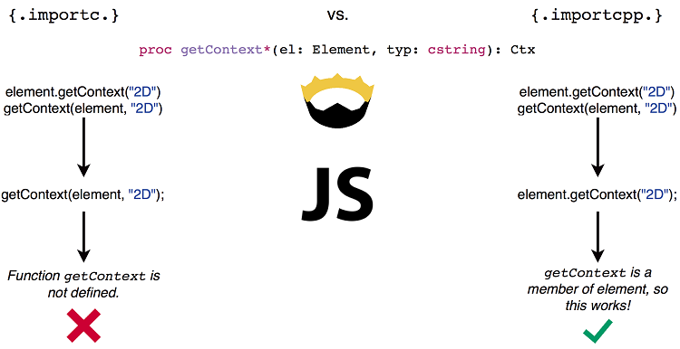
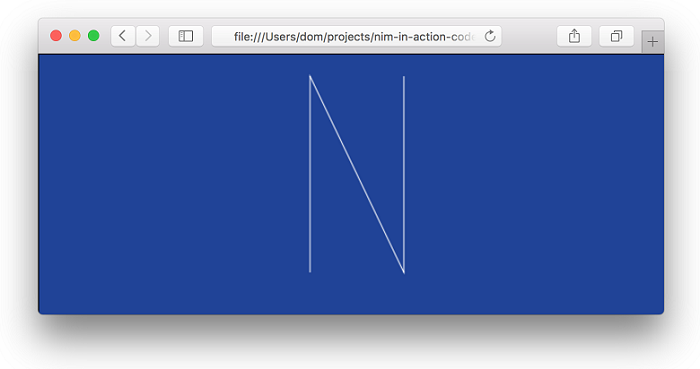

# 8.与其他语言交互

本章包括：
* Nim的外部函数接口
* 静态链接和动态链接的区别
* 为外部C库创建包装器
* 使用JavaScript后端
* 包装JavaScript API

多年来，计算机程序员一直在用各种编程语言编写软件库。许多这样的图书馆已经开发了很长一段时间，获得了许多功能，并在多年中变得稳定。当然，这些库通常不是用Nim编写的，而是用C和C++等较旧的编程语言编写的。

在编写软件时，您可能遇到了需要外部C库来执行任务的情况。一个很好的例子是OpenSSL库，它实现了SSL和TLS协议。它主要用于通过互联网安全地传输敏感数据，例如，当使用HTTPS协议导航到网站时。

包括Nim在内的各种编程语言的标准库中，存在的许多HTTP客户端模块都使用该库，来安全地和HTTP服务器传输加密数据。你很容易忘记使用该库，因为它通常在后台调用，却减少了程序员需要做的工作量。

标准库为您处理了很多事情。这包括与其他语言的接口，OpenSSL库就是如此。当然，有时您需要自己与库交互。

本章将为您做好准备。首先，您将学习如何调用用C编程语言实现的过程。除此之外，还将向您展示如何向这些过程传递数据以及如何从这些过程接收数
据。之后，您将看到如何包装名为SDL的外部库，并将使用包装器创建一个在屏幕上绘制的简单SDL应用程序。最后，您将使用JavaScript后端；包装Canvas API并在屏幕上绘制形状。

Nim使得调用用C编程语言实现的过程变得特别容易。这是因为Nim主要编译为C。Nim的其他编译后端（包括C++、Objective C和JavaScript）也使得使用这些语言编写的库变得容易。

## 8.1 Nim 的外部函数接口

FFI或外部函数接口是Nim可以调用用另一种编程语言编写的过程的机制。大多数语言都提供了它，但它们并不都使用相同的术语。例如，Java将其FFI称为Java本机接口，而C#等公共语言运行时语言将其称为P/Invoke。

在许多情况下，FFI被用于使用较低级别语言定义和实现的服务。这种较低级别的语言通常是C或C++，因为许多重要的操作系统服务都是使用这些语言定义的。Nim的标准库广泛使用FFI来利用操作系统服务；这样做是为了执行诸如读取文件或网络通信之类的任务。

近年来，网络已经成为自己的平台。检索和显示网页的Web浏览器实现“JavaScript编程语言，允许在浏览器内轻松运行复杂和动态的web应用程序。为了在web浏览器中运行并利用其提供的服务，如文档对象模型或WebGL，Nim源代码可以编译为JavaScript。访问这些服务和过多的JavaScript库也可以通过FFI完成Nim的外国金融机构。

图8.1：使用Nim外部函数接口（FFI），您可以利用其他语言的服务。Nim提供了两个版本的FFI：一个用于C、C++和Objective C，另一个用于JavaScript。两者不能在同一应用程序中使用。


需要注意的是，FFI允许您在同一应用程序中与C、C++和Objective C库交互，但不能同时与C和JavaScript库交互。这是因为C++和Objective C都与C向后兼容，而JavaScript是一种完全不同的语言。

### 8.1.1静态与动态链接
在更详细地了解FFI之前，让我们先看看C、C++和Objective C库链接到Nim应用程序的两种不同方式。
当使用外部库时，您的应用程序必须能够找到它。该库可以嵌入到应用程序的二进制文件中，也可以位于用户计算机上的某个位置。前者指的是静态链接库，而后者指的是动态链接库。

动态和静态链接都受支持，但Nim更喜欢动态链接。每种方法都有其优点和缺点。支持动态链接，因为：
* 可以更新库以修复错误和安全缺陷，而无需更新使用库的应用程序。
* 为了编译使用链接库的应用程序，不需要安装链接库的开发版本。
* 一个动态库可以在多个应用程序之间共享。
  
静态链接的最大优点是避免了依赖性问题。这些库都包含在一个可执行文件中，这简化了应用程序的分发和安装。当然，这也可以被视为一个缺点，因为这些可执行文件的大小可能会变得非常大。

而是在应用程序首次启动时加载动态链接的库。应用程序将搜索所需库的特殊路径，如果找不到这些库，应用程序将无法启动。图8.2显示了如何在静态链接和动态链接的应用程序中加载库。

图8.2.静态与动态链接


了解静态链接库和动态链接库之间的区别很重要。了解应用程序所依赖的动态链接库很重要，因为如果没有这些库，它将无法运行。考虑到这些差异，让我们看看在Nim中创建包装器的过程。

### 8.1.2包装C程序

本节将向您展示如何包装一个广泛使用且相当简单的C过程：printf过程。在C中，printf过程声明如下：

`int printf(const char *format, ...);`

您在上面的列表中看到的是printf的过程原型。原型指定了过程的名称和类型签名，但省略了它的实现。包装过程时，实现并不重要，重要的是过程原型。如果您不熟悉此过程，您将在本节稍后部分看到它的作用。

为了包装C过程，您必须充分了解这些过程原型。让我们看看前面的代码清单中显示的过程原型告诉我们printf的内容。从左到右，第一个单词指定过程的返回类型，在本例中为int。第二个单词指定程序名printf。下面是该过程所采用的参数列表，在本例中是const char*类型的格式参数，以及由省略号表示的变量数量。

表8.1总结了printf原型定义的信息。

表8.1.printf原型概要
|  返回值   | 函数名  | 第一个参数类型 | 第一个参数名 | 第二个参数 |
|  ----  | ----  |  ----  | ----  |  ----  |
|  int  | printf  |  const char *  | format  |  Variable number of arguments  |


该原型具有两个特殊功能：
const char* 类型，表示指向不可变字符的指针。
此函数采用的可变参数数。

* 在许多情况下，像这样，const char*类型表示字符串。在C中没有字符串类型，而是使用指向字符列表开头的指针。
const char* 类型，表示指向不可变字符的指针。
* 此过程采用的可变参数数。

在许多情况下，像这样，const char*类型表示字符串。在C中没有字符串类型，而是使用指向字符列表开头的指针。

在包装过程时，您需要查看每种类型并找到一个Nim等价类型。printf原型有两种参数类型：int和const char*。Nim分别为cint和cstring定义了一个等效类型。这些类型中的c并不代表c语言类型，而是“代表”兼容“，因此cstring类型是一个”兼容字符串“类型。这是因为c不是Nim的FFI支持的唯一语言，cstring类也用作本地JavaScript字符串。

这些类型是在隐式导入的系统模块中定义的，您可以在其中找到许多其他类似的类型。例如：

```Nim
  cstring
  cint, cuint
  pointer
  clong, clonglong, culong, culonglong
  cchar, cschar, cuchar
  cshort, cushort
  cint
  csize
  cfloat
  cdouble, clongdouble
  cstringArray
```

让我们将所有这些放在一起并创建包装程序。图8.3显示了一个包装 printf 的过程。

图8.3.包裹在Nim中的printf


以下代码列表显示了如何调用过程：

```nim
proc printf(format: cstring): cint {.importc, varargs.}

discard printf("My name is %s and I am %d years old!\n", "Ben", 30)
```

保存文件到 ffi.nim, 然后使用命令编译并运行： nim c -r ffi.nim. 您将看到以下输出。

```bash
My name is Ben and I am 30 years old!
```

printf过程采用字符串常量格式，提供输出的描述。它指定格式字符串中要printf的参数的相对位置，以及此过程应生成的输出类型。后面的参数指定格式字符串中的每个格式说明符应替换为什么。然后，该过程返回打印字符的计数。


您可能会立即注意到的一件事是丢弃关键字。Nim需要返回值，这些值不用于使用discard关键字显式丢弃。这在处理返回错误代码或其他重要信息的过程时非常有用，因为忽略它们的值可能会导致问题。在printf的情况下，可以安全地隐式丢弃该值。｛.discardable.｝pragma可用于此目的：

```nim
proc printf(format: cstring): cint {.importc, varargs, discardable.}

printf("My name is %s and I am %d years old!\n", "Ben", 30)
```
但真正使这个过程有效的是importc pragma。此pragma要求Nim编译器从C中导入printf过程。导入的名称取自过程名称，但可以通过在引号中指定不同的名称来更改，例如：

```nim
proc displayFormatted(format: cstring): cint {.importc: "printf", varargs, discardable.}

displayFormatted("My name is %s and I am %d years old!\n", "Ben", 30)
```

这就是它的全部内容。printf过程现在将printf过程包装在C标准库中。您甚至可以导出它，并从其他模块使用它。


### 8.1.3 类型兼容性

您可能想知道为什么需要使用cstring和cint类型。为什么不能使用string和int？让我们试试看会发生什么。

修改ffi.nim文件，使printf过程返回int类型并将字符串类型作为第一个参数。然后重新编译并运行程序。

该程序可能不会显示任何输出。这凸显了使用FFI带来的不幸危险。在这种情况下，函数 调用什么都不做，或者至少看起来是这样。在其他情况下，您的程序甚至可能崩溃。编译器会相信你告诉它的一切，因为它无法知道你的程序是否在撒谎。

由于cstring类型已更改为字符串类型，因此程序现在将Nim字符串对象传递给C 的 printf 函数。C 期望接收一个const char* 类型，但它总是假设它接收到它。这会导致各种问题，其中一个主要问题是内存损坏。


Nim的字符串类型不像C那样简单。但与之类似，Nim字符串是一个包含两个字段的对象：字符串的长度和指向字符数组的指针。这就是为什么Nim字符串可以很容易地转换为const char* 。事实上，因为这种转换非常简单，所以它对您来说是隐式完成的，这就是为什么尽管在前面的代码中，您向 printf 传递了一个字符串，即使该字符串需要是一个 cstring，该示例仍会编译。

从cstring到string的转换

另一方面，从cstring到字符串的转换不是隐式的，因为它有一些开销。这就是为什么必须使用类型转换或$运算符显式执行此操作。

至于cint类型，它实际上与int类型非常相似。您可以查看Nim文档，看看它实际上只是int32的别名：
 <http://nim-lang.org/docs/system.html#cint>. int和int32类型之间的区别在于前者的位宽取决于当前架构，而后者的位宽总是32位。

系统模块定义了更多的兼容类型，其中许多是受C的启发，但有时也需要导入在C中定义的类型。下一节将向您展示如何做到这一点。

### 8.1.4 包装 C 类型

绝大多数与C库的接口都涉及函数的包装。其次是类型的包装，这一部分将演示它。


在上一节中，我向您展示了如何包装printf函数。在本节中，您将看到如何包装 time 和 localtime 函数，这允许您以秒为单位检索当前系统时间，并将该时间分别转换为日历时间。


让我们从包装 time 函数开始。我们可以查看函数原型的在线文档，如网址 <http://en.cppreference.com/w/c/chrono/time> 指定的原型如下:

`time_t time( time_t *arg );`

对time_t类型的进一步研究表明，它是一个有符号整数。[25]这就是我们在Nim中定义这一函数所需要知道的一切。清单8.1显示了这个声明。

清单8.1.包装时间
```Nim
type
  CTime = int64   ❶

proc time(arg: ptr CTime): CTime {.importc, header: "<time.h>".}   ❷
```

>❶ CTime类型是time_t的包装版本，定义为64位有符号整数的简单别名。
❷ time的C函数 在 ＜time.h＞ 头文件中定义，为了导入它，需要 header pragma编译指示。


在本例中，我们自己包装time_t类型。函数声明有两个有趣的新特性。首先，它使用ptr关键字模拟time_t*类型，即指向time_t类型的指针。声明还使用了一个尚未显示的编译指示：header pragma。此pragma指定包含导入函数的头文件。

时间过程返回自Unix时间（1970年1月1日，星期四）以来的秒数。

要将时间结果转换为当前的小时和分钟，我们需要包装localtime函数并调用它，<http://en.cppreference.com/w/c/chrono/localtime> 指定原型如下所示：

`struct tm *localtime( const time_t *time );`

localtime 函数获取指向time_t值的指针，并返回指向 结构tm 的指针。Nim中的结构相当于对象。不幸的是，无法单独通过返回类型，来判断localtime返回的结构是在栈上还是在堆上分配的。


每当C函数返回 指向数据的结构指针时，研究该指针是否需要由你的代码进行手动释放是很重要的。此函数的文档说明返回值是“指向静态内部tm结构对象的指针”。这意味着对象具有静态存储持续时间，因此不需要手动解除分配。每个好的库都会在其文档中说明对象的存储持续时间。

包装代码时，您无疑会遇到一个返回具有动态存储持续时间的对象的函数。在这种情况下，每次调用新对象时，该函数都会分配一个新对象，每当您不再需要它时，您的工作就是释放它。

struct tm 类型 比time_t类型复杂得多。文档可在<http://en.cppreference.com/w/c/chrono/tm>,显示它包含9个整数字段。这个类型在C中的定义如下：

```C
struct tm {
   int tm_sec;
   int tm_min;
   int tm_hour;
   int tm_mday;
   int tm_mon;
   int tm_year;
   int tm_wday;
   int tm_yday;
   int tm_isdst;
};
```

包装这种类型相当简单，虽然有点乏味。一个很好的技巧是，除非您需要访问所有字段，否则不必包装整个类型。现在，我们只包装tm_min和tm_hour字段。清单8.2显示了如何将tm类型与两个字段包装在一起。

清单8.2.包装tm结构
```nim
type
  TM {.importc: "struct tm", header: "<time.h>".} = object   ❶
    tm_min: cint    ❷
    tm_hour: cint   ❷
```

>❶请注意，在pragma的参数中不能省略struct关键字。
❷这两个字段的定义与任何Nim数据类型相同。重要的是cint的使用。

然后可以包装localtime过程，并将其与时间过程一起使用，如清单8.3所示。

清单8.3.完整的时间和本地时间包装

```Nim
type
  CTime = int64

proc time(arg: ptr CTime): CTime {.importc, header: "<time.h>".}

type
  TM {.importc: "struct tm", header: "<time.h>".} = object
    tm_min: cint
    tm_hour: cint

proc localtime(time: ptr CTime): ptr TM {.importc, header: "<time.h>".}   ❶

var seconds = time(nil)            ❷
let tm = localtime(addr seconds)   ❸
echo(tm.tm_hour, ":", tm.tm_min)   ❹
```

> ❶localtime过程使用 time_t* 并返回结构 tm*，这两个都是指针。这就是为什么使用ptr关键字。
  ❷将time函数 调用的结果分配给新的 seconds 变量。
  ❸将seconds变量的地址传递给localtime过程。
  ❹显示当前时间。

将其保存为 ffi2.nim ，然后编译并运行它。您应该在执行后看到屏幕上显示的当前时间，例如18:57。

清单8.3中示例的主要内容是包装一个类型，实际上涉及将其结构复制到Nim类型定义中。重要的是要记住，字段名必须与C类型的字段名相匹配。如果要重命名，可以在importc pragma中指定每个字段的名称。图8.4说明了这一点。


图8.4.包装类型 和 C结构字段之间的映射


另一个有趣的方面是需要向localtime过程传递指针。我们需要在包装中说明这一点。addr关键字返回一个指向指定值的指针，该值必须是可变的，这就是为什么在清单8.3中将time的返回值分配给一个新的seconds变量的原因。写入localtime（addr time（nil）不能工作，因为返回值还没有固定存储在任何地方。

考虑到所有这些，您现在应该对如何在Nim中包装C类型有了很好的了解。现在是时候包装一些更宏大的东西了：一个外部库。

[25] time_t 类型 : <http://stackoverflow.com/a/471287/492186>

## 8.2 包装外部C库

到目前为止，我已经向您展示了如何包装一些非常简单的函数，这些函数是C标准库的一部分。这些函数中的大多数已经在某种程度上被Nim标准库包装，并通过诸如times模块之类的模块导出了。

包装外部库略有不同。本节将通过向您展示 如何包装SDL库 的一小部分来教您这些差异。

Simple DirectMedia Layer（SDL）是一个跨平台的多媒体库。它是用于编写计算机游戏和其他多媒体应用程序的广泛使用的库之一。SDL管理视频、音频、输入设备等。您可以使用它进行一些实际操作，例如在屏幕上绘制2D图形或播放声音效果。

下面正是我将向您展示这些方法。在本节结束时，您将生成一个显示图8.5所示窗口的应用程序。

> SDL包装器
这里显示的包装将是非常基本的。Nim社区已经创建的完整SDL包装，请看这里：<https://github.com/nim-lang/sdl2>

图8.5.您将在本节中生成的应用程序


### 8.2.1 下载SDL库

在开始编写SDL库的包装器之前，您应该下载它。为了使用这个包装器，您只需要SDL的运行时二进制文件；可从以下网站下载：<http://www.libsdl.org/download-2.0.php#source>

### 8.2.2 创建包装

包装器由一个或多个包含包装函数和类型定义的模块组成。包装器通常镜像C头文件的内容，其中包含函数原型和类型的多个声明。但也可以镜像JavaScript API 参考文档的内容。

对于像SDL这样的大型库，这些头文件非常大，包含数千个函数原型和数百种类型。好消息是，为了使用库，您不需要将其全部打包。几个过程和类型就可以了。这意味着您可以按需包装库；与其花几天时间包装整个库，包括您永远不会使用的过程，不如包装您需要使用的过程。

就像在上一节中一样，您可以在线查找正在包装的函数原型的定义。这样做的缺点是可能会产生不可靠或过时的信息。但通常情况下，它比在几十个头文件中搜索正确的函数要方便得多。

但在此之前，您需要弄清楚需要包装的内容。最简单的方法是查找C语言中的示例，说明如何使用所涉及的库来开发执行所需操作的程序。本节的目标是创建一个应用程序，该应用程序显示指定颜色的窗口，如图8.5所示。

SDL库的功能肯定要强大得多，但为了向您展示如何包装它，最好关注尽可能小的示例。

记住这一点，让我们开始吧。包装器本身将是一个名为sdl的模块。在进入下一节之前，通过创建名为sdl.nim的新文件来创建此模块。

### 8.2.3 动态链接

在本章的前面，我已经解释了静态链接和动态链接之间的区别。您在上一节中包装的过程是C标准库的一部分，因此使用的链接过程是自动为您选择的。链接C标准库的过程取决于操作系统和C编译器。

当涉及到与外部C库的链接时，建议使用动态链接。这个过程涉及一些小的初始设置，我将在这里解释。

每当您指示Nim编译器与C库动态链接时，您必须向其提供该库的文件名。每个库的文件名将完全取决于库和为其构建的操作系统。表8.2显示了Windows、Linux和Mac OS X的SDL库文件名：

表格 8.2. SDL库文件名
| Windows	| Linux	| Mac OS X |
| --- |--- |--- |
| SDL2.dll| libSDL2.so | libSDL2.dylib |

这些文件被称为共享库文件，因为在许多情况下，特别是在类Unix操作系统上，它们在多个应用程序之间共享。

SDL包装器需要知道这些文件名。让我们在刚刚创建的sdl模块中定义它们。清单8.4显示了如何为每个操作系统定义这些。

清单8.4.根据操作系统定义共享库文件名
```nim
when defined(Windows):
  const libName* = "SDL2.dll"
elif defined(Linux):
  const libName* = "libSDL2.so"
elif defined(MacOsX):
  const libName* = "libSDL2.dylib
```
将此代码添加到sdl模块。

这段代码相当简单。每个操作系统上只定义了一个常量libName，其名称保持不变，但其值在每个操作系统之间变化。这将允许包装器在所有3个主要操作系统上工作。

这就是所需的全部设置。严格来说，这不是绝对必要的，但这确实意味着这些文件名可以在以后很容易地更改。
现在回想上一节，我向您展示了标题和importc pragma。这些用于从C标准库中的特定标头导入C过程。为了指示编译器动态链接过程，需要使用名为dynlib的新pragma。例如：

`proc init*(flags: uint32): cint {.importc: "SDL_Init", dynlib: libName.}`

dynlib pragma有一个参数：定义导入过程的共享库的文件名。每次启动应用程序时，它都会尝试加载这些pragma定义的所有共享库。如果找不到共享库或共享库中不存在包装的函数，则应用程序将显示错误并终止。


dynlib pragma还支持简单的版本控制方案。例如，如果要加载libSDL2-2.0.1.so 或libSDL2.so，则可以指定 "libSDL2(|-2.0.1).so" 作为dynlib的参数。Nim手册中提供了有关dynlib pragma的更多信息：<http://nim-lang.org/docs/manual.html#foreign-function-interface-dynlib-pragma-for-import>


现在你可以开始包装了。

### 8.2.4包装类型

在成功包装所需的过程之前，必须首先定义四种类型。谢天谢地，包装它们的内部并不是必须的，它们只是充当存根来识别一些对象。清单8.5显示了如何定义这些类型。

清单8.5.包装4个必要类型
```nim
type
  SdlWindow = object     ❶
  SdlWindowPtr* = ptr SdlWindow       ❷
  SdlRenderer = object   ❶
  SdlRendererPtr* = ptr SdlRenderer   ❷
```

>❶定义对象存根。这个对象当然包含字段，但我们不需要在应用程序中访问它们，因此可以省略它们的定义。
❷SDL库中的许多过程都使用指向对象的指针，只需给该类型一个名称并将其导出，而不是到处编写`ptr TheType`，这很方便。

类型定义相当简单。SdlWindow类型将表示单个屏幕的 SDL窗口 和 SdlRenderer将表示用于渲染到SDL窗口上的对象。

指针类型是为了方便而定义的，它们是导出的，因为您将包装的SDL函数很快会返回它们。现在让我们来看看这些函数。

### 8.2.5 包装程序

为了使用SDL在屏幕上显示彩色窗口，只需要包装少数几个函数。清单8.6显示了定义这些函数的C语言原型。


清单8.6.将在本节中包装的SDL库C函数原型
```c
int SDL_Init(Uint32 flags)            ❶

int SDL_CreateWindowAndRenderer(int            width,
                                int            height,
                                Uint32         window_flags,
                                SDL_Window**   window,
                                SDL_Renderer** renderer)   ❷

int SDL_PollEvent(SDL_Event* event)   ❸

int SDL_SetRenderDrawColor(SDL_Renderer* renderer,
                           Uint8         r,
                           Uint8         g,
                           Uint8         b,
                           Uint8         a)      ❹

void SDL_RenderPresent(SDL_Renderer* renderer)   ❺

int SDL_RenderClear(SDL_Renderer* renderer)      ❻
```


>❶初始化SDL库。
❷创建SDL窗口和与该窗口关联的渲染上下文。
❸检查输入事件。
❹设置指定渲染器上的当前绘图颜色。
❺使用执行的渲染更新屏幕。
❻使用绘图颜色清除指定的渲染器。

您已经了解了如何包装SDL_Init过程：

`proc init*(flags: uint32): cint {.importc: "SDL_Init", dynlib: libName.}`

这个过程的包装非常简单。原型中的Uint32和int类型分别映射到Uint32和cint 的 Nim类型。注意该过程是如何重命名为init的，这是因为SDL_前缀在Nim中是冗余的。

现在考虑其余的过程。每个包装的过程都需要指定相同的dynlib pragma。您可以使用另一个名为push pragma的pragma来删除此重复。push pragma允许您将指定的pragma应用于过程。

下面定义的过程或类型，直到使用相应的pop pragma。清单8.7显示了如何在push pragma的帮助下包装其余的过程。

清单8.7包装sdl模块中的过程
```nim
{.push dynlib: libName.}   ❶
proc init*(flags: uint32): cint {.importc: "SDL_Init".}

proc createWindowAndRenderer*(width, height: cint, window_flags: cuint,
    window: var SdlWindowPtr, renderer: var SdlRendererPtr): cint        ❷
    {.importc: "SDL_CreateWindowAndRenderer".}

proc pollEvent*(event: pointer): cint {.importc: "SDL_PollEvent".}       ❸

proc setDrawColor*(renderer: SdlRendererPtr, r, g, b, a: uint8): cint
    {.importc: "SDL_SetRenderDrawColor", discardable.}                   ❹

proc present*(renderer: SdlRendererPtr) {.importc: "SDL_RenderPresent".}

proc clear*(renderer: SdlRendererPtr) {.importc: "SDL_RenderClear".}

proc drawLines*(renderer: SdlRendererPtr, points: ptr tuple[x, y: cint],
    count: cint): cint {.importc: "SDL_RenderDrawLines", discardable.}   ❺
{.pop.}   ❻
```

“
>❶这确保每个进程都得到dynlib pragma。
❷这里使用var关键字代替ptr。在Nim，这些代码最终生成了等效的C代码。
❸Nim中的指针类型相当于void*，它是任何类型的指针。
❹此处使用可丢弃的pragma来隐式丢弃返回值。
❺points参数是指向元组列表开头的指针。
❻这将停止dynlib pragma的传播。

大多数代码都相当标准。createWindowAndRenderer过程的参数包括指向SdlWindow和SdlRenderer指针的指针，分别写为SdlWindow** 和SdlRender**。指向SdlWindow和SdlRenderer的指针已在上一小节中分别以SdlWindowPtr和SdlRenderPtr的名称定义，因此您可以将这些参数的类型定义为ptr SdlWindowPtr和ptr Sdl RendererPtr。这将很好地工作，但在这种情况下，使用var代替ptr也是合适的。

您可能还记得第6章中使用的 `var T`，它用于将结果存储在作为参数传递给过程的变量中。

createWindowAndRenderer过程也在做同样的事情。Nim使用指针实现这些var参数，因此使用var定义参数的类型是完全有效的。这样做的好处是您不再需要我们使用Nim的addr函数，也可以防止您为该参数传递nil。

对于pollEvent过程，参数类型定义为指针。此类型相当于C中的 void* 类型，本质上是指向任何类型的指针。这样做是因为它避免了包装SdlEvent类型的需要。您可能会遇到C库，这些库声明过程接受 void* 类型，在这种情况下，您可以使用指针类型。然而，在实践中，为了提高类型安全性，最好使用ptr T类型。但是，唯一可以做到这一点的方法是，如果您知道正在包装的过程是在接受特定的指针类型。

最后，drawLines过程是最复杂的，因为它接受一个点列表作为线绘制。在C中，元素列表由指向列表中第一个元素的指针和该列表中变量的数量表示。在drawLine过程中，点列表中的每个元素都是SDL_Point类型，它被定义为包含两个整数的简单C结构显示点的x和y坐标。在Nim中，这个简单结构可以用元组表示。

现在将清单8.7的内容添加到sdl模块中。是时候用它来编写应用程序了。

### 8.2.6 使用SDL包装器。

首先在包装器所在文件夹创建sdl_test.nim文件。然后通过在文件顶部写入import sdl 来导入包装器。

在使用库之前，您必须使用init过程初始化它。init过程期望接收flags参数，该参数指定应初始化哪些SDL子系统。对于本应用程序，您只需初始化“视频子系统”。为此，您需要为SDL_INIT_VIDEO标志定义一个常量。下面的代码列表显示了可用于此操作的代码。

`const INIT_VIDEO* = 0x00000020`

此常量的值需要在Nim源文件中定义，因为它在共享库中不可用。C头文件通常使用#define来定义这些文件，该文件不会编译到任何共享库中。

将此常量添加到sdl模块中。完成后，您终于可以使用sdl包装器实现一个简单的应用程序了。清单8.8显示了执行此操作所需的代码。

清单8.8使用SDL包装器实现的SDL应用程序

```nim
import os
import sdl

if sdl.init(INIT_VIDEO) == -1:      ❶
  quit("Couldn't initialise SDL")   ❷

var window: SdlWindowPtr
var renderer: SdlRendererPtr
if createWindowAndRenderer(640, 480, 0, window, renderer) == -1:   ❸
  quit("Couldn't create a window or renderer")   ❹

discard pollEvent(nil)   ❺
renderer.setDrawColor 29, 64, 153, 255           ❻
renderer.clear           ❼

renderer.present         ❽
sleep(5000)              ❾
```

>❶初始化SDL视频子系统。
❷如果初始化失败，则退出并显示错误。
❸创建一个窗口和渲染器来绘制对象。
④如果创建窗口或渲染器失败，则退出并返回错误。
⑤这是处理任何未决输入事件的地方。对于此应用程序，只调用它，以便窗口正确初始化。
⑥将图形颜色设置为指定的红色、绿色、蓝色和alpha值。
❼使用指定的图形颜色清除屏幕。
❽显示渲染器上绘制的像素。
❾等待5秒钟，然后终止应用程序。

编译并运行sdl_test.nim文件。您应该看到一个蓝色背景的窗口，如图8.6所示。

图8.6 运行图8.6的结果应该是什么样子


一个空白的SDL窗口是一个伟大的成就，但它不是一个非常令人兴奋的窗口。让我们使用drawLines过程在屏幕中间绘制字母N。以下代码显示了如何做到这一点：

```nim
renderer.setDrawColor 255, 255, 255, 255              ❶
var points = [   ❷
  (260'i32, 320'i32),
  (260'i32, 110'i32),
  (360'i32, 320'i32),
  (360'i32, 110'i32)
  ]
renderer.drawLines(addr points[0], points.len.cint)   ❸
```

>❶将绘图颜色更改为白色。
❷定义一组点，这些点定义绘制N的坐标。每个坐标都必须是int32，因为这就是cint。
❸绘制由点数组定义的线。

将此代码添加到sdl_test.nim文件中render.clear语句的正下方。然后编译并运行sdl_test.nim文件。您应该看到一个蓝色背景和字母N的窗口，如图8.7所示。

图8.7绘制字母N的最终sdl_test应用程序


在上面的代码中，drawLines调用是一个重要的调用。点数组中第一个元素的地址与点数组的长度一起传递给此过程。然后，drawLines过程具有读取数组中所有点所需的所有信息。需要注意的是，此调用不是内存安全的，如果点数太高，drawLines程序将尝试读取与数组相邻的内存。这被称为缓冲区过度读取，脚注：缓冲区过度阅读，<https://en.wikipedia.org/wiki/Buffer_over-read>并且可能导致严重的问题，因为无法知道相邻存储器包含什么。

这就是使用Nim包装外部库的方式！当然，还有很大的改进空间。理想情况下，提供高级API的模块应该始终写在包装器的顶部；这样，可以使用更直观的界面来编写应用程序。目前，对sdl模块的最大改进是添加了异常。init和createWindowAndRenderer都应该在发生错误时引发异常，而不是要求用户手动检查返回值。

最后两部分为您提供了C FFI的概述。Nim还支持与其他类似C语言的接口，包括C++和Objective C。不幸的是，这两个后端超出了本书的范围，但到目前为止您所学到的概念应该为您提供一个良好的起点。有关这些的更多信息，请参阅Nim手册：<http://nim-lang.org/docs/manual.html#implementation-specific-pragmas-importcpp-pragma>

下一节将向您展示如何编写JavaScript包装器。

## 8.3 JavaScript 后端

今天，JavaScript越来越被称为“网络的汇编语言”，因为有许多新的语言，由于其在web浏览器中的广泛使用，它的目标是JavaScript。由于许多原因，可以翻译为JavaScript的语言是非常理想的。可以翻译成JavaScript但也可以用于编写桌面应用程序的语言的最大优点之一，是能够在客户端脚本和服务器应用程序之间共享相同的代码。前者将运行在用户的web浏览器中，后者将在某个服务器上运行。

例如，考虑一个聊天应用程序：服务器管理来自多个客户端的连接和消息。客户端脚本允许用户连接到服务器，并从web浏览器向服务器发送消息。所有客户端和服务器都必须理解这些消息，因此，解析这些消息的代码在服务器和客户端之间共享是有益的。如果客户端和服务器都是用Nim编写的，那么共享这段代码就很简单了。图8.8显示了这样的聊天应用程序如何利用Nim的JavaScript后端。

图8.8两个平台之间如何共享相同的代码


当然，在编写JavaScript应用程序时，有时需要与web浏览器公开的API，以及抽象这些API的库进行交互。包装JavaScript过程和类型的过程与前面C后端部分中描述的过程类似，但有一些不同点需要得解释。

本节将向您展示如何使用类似SDL库包装 所需的 JavaScript 程序，以实现与上一节中相同的效果：用蓝色填充可绘制的表面，并绘制一系列线条以形成字母N。

### 8.3.1 包装Canvas画布元素

Canvas画布元素是HTML5的一部分，允许在HTML网页上呈现2D形状和位图图像。所有主要的web浏览器都支持它，并通过JavaScript API公开它。

举一个使用示例，假设HTML页面包含一个ID为canvas的＜canvas＞元素，其大小为600x600，清单8.9中的代码将用蓝色填充画布。


清单8.9.在JavaScript中使用Canvas API
```javascript
var canvas = document.getElementById("canvas");
canvas.width = 600;
canvas.height = 600;
var ctx = canvas.getContext("2d");

ctx.fillStyle = "#1d4099";
ctx.fillRect(0, 0, 600, 600);
ctx.strokeStyle = "#ffffff";
ctx.moveTo(250, 320);
ctx.lineTo(250, 110);
ctx.lineTo(350, 110);
ctx.lineTo(350, 320);
ctx.stroke();
```

这段代码是非常不言自明的。代码首先通过ID从文档对象模型中检索画布元素。设置画布大小并创建2D绘图上下文。最后用蓝色填充屏幕，使用moveTo和lineTo程序跟踪字母N，最后使用笔划程序绘制字母。包装本例中使用的过程不应该花费太多的精力，所以让我们开始吧！

创建一个名为canvas.nim的新文件。该文件将包含使用canvas API所需的过程包装器。

getElementById过程已经由Nim包装，它是文档对象模型的一部分，因此可以通过dom模块使用。

与C不同，JavaScript中没有头文件。同样，了解如何定义JavaScript过程的最简单方法是查看文档。以下列表包含将在本节中包装的类型和过程的文档：


* CanvasRenderingContext2D type - <https://developer.mozilla.org/en-US/docs/Web/API/CanvasRenderingContext2D>
* canvas.getContext(contextType, contextAttributes); procedure - <https://developer.mozilla.org/en-US/docs/Web/API/HTMLCanvasElement/getContext>
* void ctx.fillRect(x, y, width, height); procedure - <https://developer.mozilla.org/en-US/docs/Web/API/CanvasRenderingContext2D/fillRect>
* void ctx.moveTo(x, y); procedure - <https://developer.mozilla.org/en-US/docs/Web/API/CanvasRenderingContext2D/moveTo>
* void ctx.lineTo(x, y); procedure - <https://developer.mozilla.org/en-US/docs/Web/API/CanvasRenderingContext2D/lineTo>
* void ctx.stroke(); procedure - <https://developer.mozilla.org/en-US/docs/Web/API/CanvasRenderingContext2D/stroke>

因为JavaScript是一种动态类型的编程语言，所以过程定义不包含每个参数类型的信息。您必须查看文档，这些文档通常会告诉您足够的信息来确定底层类型。清单8.10显示了如何包装CanvasRenderingContext2D类型和五个过程。

清单8.10.包装画布API
```nim
import dom           ❶

type
  CanvasRenderingContext* = ref object   ❷
    fillStyle* {.importc.}: cstring      ❸
    strokeStyle* {.importc.}: cstring    ❸

{.push importcpp.}   ❹

proc getContext*(canvasElement: Element,
    contextType: cstring): CanvasRenderingContext   ❺

proc fillRect*(context: CanvasRenderingContext, x, y, width, height: int)

proc moveTo*(context: CanvasRenderingContext, x, y: int)

proc lineTo*(context: CanvasRenderingContext, x, y: int)

proc stroke*(context: CanvasRenderingContext)

{.pop.} 

```
>❶dom模块导出getContext过程中使用的Element类型。
❷所有JavaScript对象都有ref语义，因此ref对象定义也就不同了。
❸必须使用importc显式导入每个字段。
❹每个过程都有importcpp pragma。
❺contextAttributes参数在这里有意省略，它是一个具有默认值的可选参数。

这段代码非常简短，非常切题。除了importcpp pragma之外，您应该熟悉所有内容。此pragma的名称是从C++后端借来的。它指示编译器生成调用指定过程的JavaScript代码，就像它是第一个参数对象的成员一样。图8.9展示了JavaScript后端importc和importcpp之间的区别。

图8.9.importc和importcpp pragma生成的JavaScript代码的差异。



没有太多其他惊喜。需要注意的一个有趣的方面是，在JavaScript中包装数据类型时，包装的类型应该声明为ref对象。这是因为JavaScript对象具有引用语义，因此应该这样包装。

这就是它的全部！是时候使用这个包装了。

### 8.3.2 使用Canvas包装

现在包装器已经完成，您可以编写一个小脚本，使用它和一个小HTML页面来执行它。

将清单8.11保存为canvas.nim文件所在目录下的index.html。

清单8.11.index.html文件

```html
<!DOCTYPE html>
<html>
  <head>
    <meta charset="utf-8"/>
    <title>Nim in Action - Chapter 8</title>
    <script type="text/javascript" src="test.js"></script>
    <style type="text/css">
      canvas { border: 1px solid black; }
    </style>
  </head>
  <body onload="onLoad();" style="margin: 0; overflow: hidden;">
    <canvas id="canvas"></canvas>
  </body>
</html>
```
HTML非常简单，它进行了一些小的样式调整，以使画布全屏显示。它还定义了当＜body＞标记的onLoad事件触发时要调用的onLoad过程。

将清单8.12保存为canvas_test.nim文件旁边的canvas.nim。

清单8.12.canvas_test.nim文件

```nim
import canvas, dom

proc onLoad() {.exportc.} =
  var canvas = document.getElementById("canvas").EmbedElement
  canvas.width = window.innerWidth
  canvas.height = window.innerHeight

  var ctx = canvas.getContext("2d")

  ctx.fillStyle = "#1d4099"
  ctx.fillRect(0, 0, window.innerWidth, window.innerHeight)
```

注意代码与JavaScript有多相似。代码列表定义了一个onLoad过程，然后将其导出，这允许浏览器将其用作事件回调。导出过程用于执行此操作。它只是确保生成的JavaScript代码包含onLoad过程。此pragma也适用于其他后端。

您可能想知道.EmbedElement类型转换的目的是什么。getElementById过程返回Element类型的对象，不幸的是，此对象没有width或height属性，因此必须将其转换为更具体的类型。在这种情况下，嵌入元素类型允许两种宽度和高度分配。

现在，通过运行 `nim js -o:canvas_test canvas_test.nim` 来编译这个canvas_test模块。然后，您可以在您喜爱的浏览器中打开index.html文件来测试它。您应该看到类似于图8.10的内容。

图8.10.在web浏览器中执行canvas_test.nim脚本


现在这只是一个蓝屏。让我们扩展它以绘制字母N。在onLoad过程的底部添加以下代码。


```nim
ctx.strokeStyle = "#ffffff"      ❶
let letterWidth = 100            ❷
let letterLeftPos = (window.innerWidth div 2) - (letterWidth div 2)   ❸
ctx.moveTo(letterLeftPos, 320)   ❹
ctx.lineTo(letterLeftPos, 110)
ctx.lineTo(letterLeftPos + letterWidth, 320)
ctx.lineTo(letterLeftPos + letterWidth, 110)
ctx.stroke()   ❺
```

>❶将画笔颜色设置为白色。
❷创建本地letterWidth变量以存储所需的字母宽度。
❸计算字母应放在左上角的位置。
❹开始画字母的线条。
❺画出这个字母。

在这种情况下，代码计算字母的位置，使其位于屏幕中间。这是因为画布大小取决于web浏览器窗口的大小，在SDL示例中，这是不必要的，因为SDL窗口总是相同的大小。

通过再次运行相同的命令重新编译canvas_test文件，然后刷新浏览器。您应该看到类似于图8.11的内容。

图8.11.在web浏览器中执行canvas_test.nim脚本


这就是全部内容。您现在应该对如何包装JavaScript以及如何使用Nim的JavaScript后端有了很好的基本了解。

## 8.4 总结

* Nim外部过程接口支持与C、C++、Objective C和JavaScript的接口。
* C库可以与Nim应用程序静态链接或动态链接。
* C头文件声明了过程原型和类型，它们提供了包装它们所需的所有信息。
* importc pragma用于包装外部过程，包括C和JavaScript过程。
* discardable pragma可用于重写显式丢弃值的需要。
* csring类型应用于包装接受字符串参数的过程。
* 使用外部C库最好通过动态链接完成。
* dynlib pragma用于从共享库导入过程。
* importcpp pragma用于包装C++过程，也用于包装JavaScript中的成员过程。
